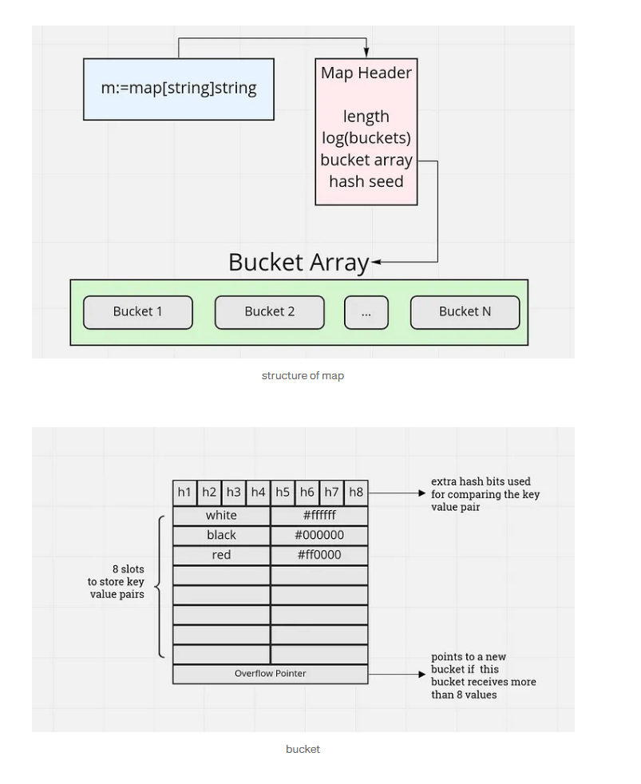

# Introduction

```
type hmap struct {
    count     int       // number of key/value pairs
    flags     uint8
    B         uint8     // log_2 number of buckets (i.e., 2^B buckets)
    noverflow uint16    // approximate number of overflow buckets
    hash0     uint32    // hash seed to prevent DoS
    buckets   unsafe.Pointer // pointer to array of buckets
    oldbuckets unsafe.Pointer // for growing
    nevacuate uintptr   // progress counter for growing
}
```

- Each bucket stores up to **8 key-value pairs**, and each bucket is a small array:

```
type bmap struct {
    tophash [8]uint8   // top 8 bits of hashed key to speed lookup
    // followed by 8 keys and 8 values (inline)
}
```



## Step-by-Step: How Go Maps Work

- 📦 Map Initialization

- 🧮 Hashing a Key

- 🪣 Selecting a Bucket

- 🧵 Inserting a Key-Value Pair

- 🔍 Lookup

- ⚖️ Growing the Map

## 1. 📦 Map Initialization

```
m := make(map[string]int)

```

Go creates an empty hash table, which consists of: <br>

- Metadata (hmap)
- A pointer to the bucket array (initially nil)
- A randomized hash seed (hash0)

🧠 Buckets aren't allocated until the first insert. <br>

## 2. 🧮 Hashing a Key

Go maps use a randomized hash function seeded with hash0. For string keys, Go uses a function like: <br>

```
hash = memhash(key, hash0)

```

- Provides randomized hash values to defend against hash collision attacks.
- Returns a uint64 or uint32 hash.

## 3. 🪣 Selecting a Bucket

The lower bits of the hash determine the bucket index. <br>

```
bucketIndex = hash & (2^B - 1)

```

- Where B is the number of buckets (2^B total buckets).
  -This picks the correct bucket.
- 📝 B increases as the map grows. Initially, B = 1, then B = 2, B = 3, ..., up to B = 15 or more.

## 4. 🧵 Inserting a Key-Value Pair

Each bucket can hold up to 8 key/value pairs and tophash values. <br>

```
type bmap struct {
    tophash [8]uint8
    keys    [8]KeyType
    values  [8]ValueType
    overflow *bmap
}

```

#### Insertion Steps:

1. Compute tophash from upper hash bits. <br>
2. Check each of the 8 slots for: <br>

- Empty slot → insert
- Matching key → overwrite value <Br>

  3.If full, allocate an overflow bucket and link it.

#### Example:

```
v, ok := m["go"]

```

Hash("go") → 64-bit value <br>

Bucket index → hash & (2^B - 1) <br>

tophash = hash >> (64 - 8) <br>

Store in first empty slot with that tophash <br>

## 5. 🔍 Lookup

```
v, ok := m["go"]

```

Steps: <br>

Hash the key → bucket index <br>

Check tophash[] in the bucket for match <br>

If match, compare keys <br>

If key is found, return value <br>

💡 Why tophash? <br>

Speeds up scan — only compare full keys if tophash matches. <br>

If not found in base bucket, Go scans overflow buckets. <br>

## 6. ⚖️ Growing the Map (Rehashing)

When does Go grow a map? <br>

- When the load factor is too high (i.e., too many keys per bucket)
- Or too many overflow buckets

### How growth works:

Double the number of buckets: 2^B → 2^(B+1) <br>

Allocate new bucket array <br>

Incremental rehashing: on each insert/lookup, a few entries are moved from the old bucket to the new one. <br>

✅ This avoids large pause times (like in Java's HashMap rehash). <br>

## 🌩️ Hash Collisions & Overflow Buckets

Go handles hash collisions with open addressing + chaining overflow buckets. <br>

Buckets overflow when all 8 slots are filled. <br>

Overflow buckets are linked to the main one. <br>

During lookup/insert/delete, Go traverses all buckets in the chain. <br>

📌 Map performance degrades if too many overflow buckets exist → triggers rehash. <br>
