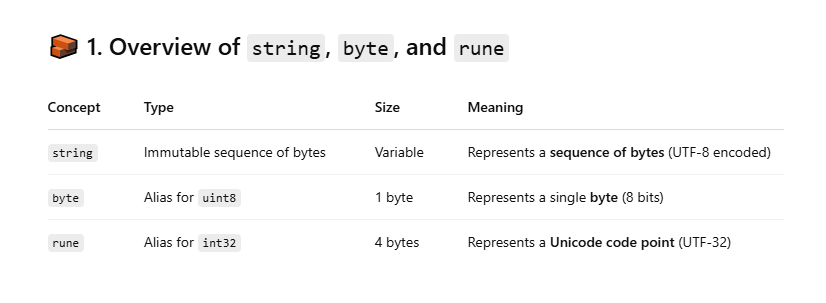

# Overview



## 🔤 2. string in Go

- Internally stored as a pointer to a byte slice + length
- Immutable – you can't change it once created
- UTF-8 encoded by default

```
type stringStruct struct {
    str *byte // pointer to data
    len int   // number of bytes (not characters!)
}
```

```
s := "Go👍"
fmt.Println(len(s))         // 5 (G=1, o=1, 👍=3 bytes)
fmt.Println(utf8.RuneCountInString(s)) // 3 (G, o, 👍)
```

## ⚠️ Edge Cases

- Slicing a string can break multibyte characters:

```
fmt.Println("👍"[0])       // 240 (only first byte of 👍)
fmt.Println("👍"[0:1])     // Invalid UTF-8 (just one byte)

```

## 🧩 3. byte — Single UTF-8 byte (alias for uint8)

- Represents a raw byte, useful when working with files, encodings, or network data

```
s := "abc"
b := []byte(s)
fmt.Println(b) // [97 98 99]

```

✅ Use Case <br>

- Efficient storage or transmission of data
- Working with non-Unicode protocols

⚠️ Edge Case <br>
byte ≠ character for multi-byte strings. <br>

```
s := "你好"
fmt.Println([]byte(s)) // [228 189 160 229 165 189] (6 bytes)

```

🧱 4. rune — Unicode Code Point (alias for int32) <br>

- Represents a single character, including non-ASCII like 你, 👍, €
- Preferred for iterating characters safely in UTF-8 strings

```
s := "Go👍"
for i, r := range s {
    fmt.Printf("Index: %d Rune: %c Unicode: %U\n", i, r, r)
}

```

✅ Use Case <br>

- When you need to read characters not bytes
- Parsing natural languages or symbol-rich text

# 🔁 Conversions Between Them

```
s := "Hello 🌍"

// string to []byte (raw bytes)
b := []byte(s)

// string to []rune (unicode-aware characters)
r := []rune(s)

// []byte back to string
s1 := string(b)

// []rune back to string
s2 := string(r)

```

# 🛠 Best Practices

Goal Recommended Approach
Read/Write raw data Use []byte
Count/Iterate characters Use []rune or for range s
Memory efficient storage Use string (internally shared, immutable)
Modify string content Convert to []rune or []byte, then back
