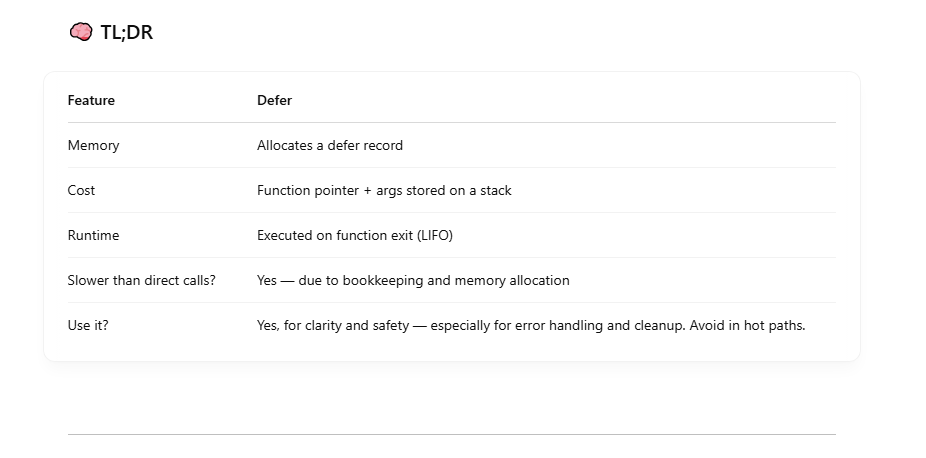
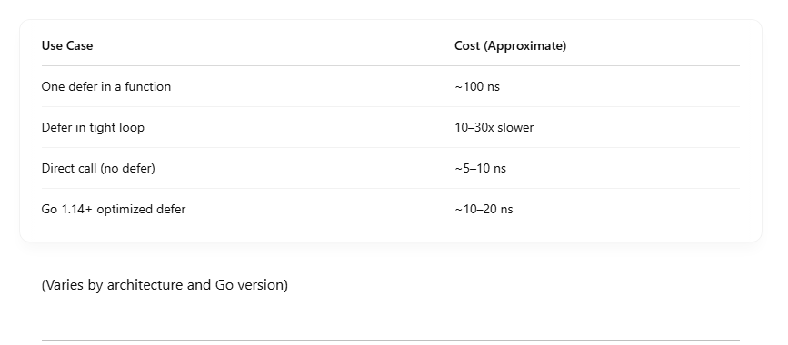
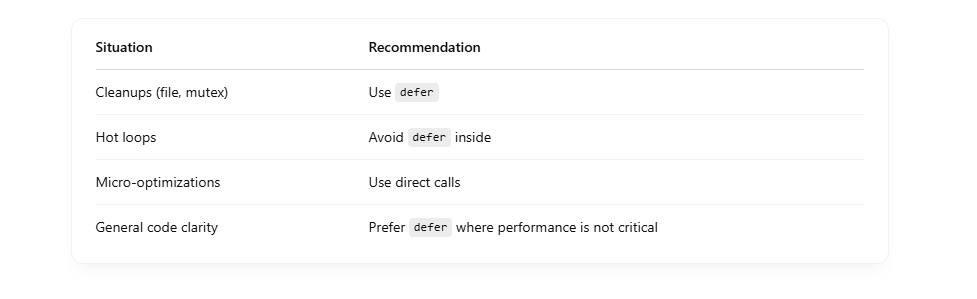

## Defer has overhead compared to a direct function call due to:

- Heap or stack allocation of the defer record.
- Bookkeeping — setting up the call, storing arguments, managing stack.
- Defer stack management — maintaining LIFO order.
- Closure capturing — when you use closures with defer, extra allocations may happen.

```
func withDefer() {
    for i := 0; i < 1000000; i++ {
        defer func() {}() // Expensive
    }
}

func withoutDefer() {
    for i := 0; i < 1000000; i++ {
        func() {}() // Cheap
    }
}

```

The withDefer version will be significantly slower and consume more memory. <br>

## ⚙️ Optimizations in Go 1.14+

Go added defer inlining and stack-based defer for common/simple cases, which reduces the overhead (by up to 10x), especially for non-escaping, non-closure defers in loops. <br>

But even so, defer is generally ~2x-6x slower than direct function calls in tight loops. <br>



## 📊 4. Realistic Overhead Estimate



# ✅ Best Practices


