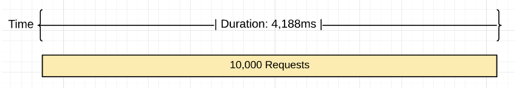
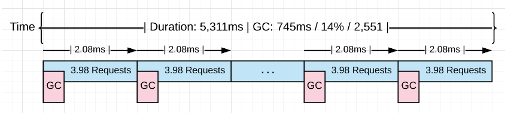
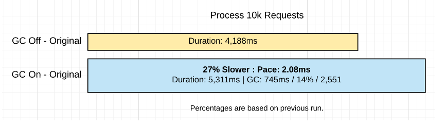
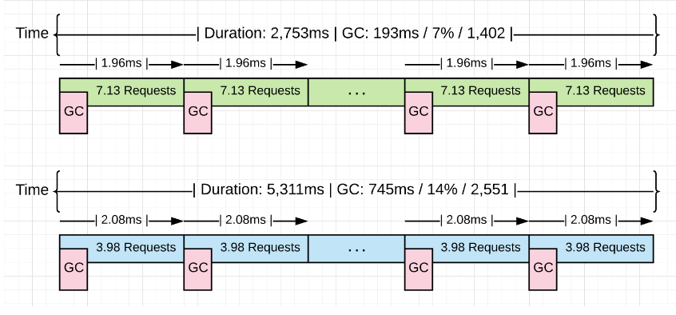
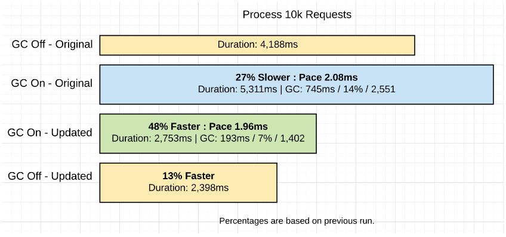

# Introduction

In the first post, I took the time to describe the behavior of the garbage collector and show the latencies that the collector inflicts on your running application. I shared how to generate and interpret a GC trace, showed how the memory on the heap is changing, and explained the different phases of the GC and how they affect latency cost. <br>

The final conclusion of that post was, if you reduce stress on the heap you will reduce the latency costs and therefore increase the application’s performance. I also made a point that it’s not a good strategy to decrease the pace at which collections start, by finding ways to increase the time between any two collections. A consistent pace, even if it’s quick, will be better at keeping the application running at top performance. <br>

In this post, I will walk you through running a real web application and show you how to generate GC traces and application profiles. Then I will show you how to interpret the output from these tools so you can find ways to improve the performance of your applications. <br>

## Running The Application

Look at this web application that I use in the Go training. <br>


Figure 1 shows what the application looks like. This application downloads three sets of rss feeds from different news providers and allows the user to perform searches. After building the web application, the application is started. <br>

```
$ go build
$ GOGC=off ./project > /dev/null
```

Listing 1 show how the application is started with the GOGC variable set to off, which turns the garbage collection off. The logs are redirected to the /dev/null device. With the application running, requests can be posted into the server. <br>

```
$ hey -m POST -c 100 -n 10000 "http://localhost:5000/search?term=topic&cnn=on&bbc=on&nyt=on"
```

Listing 2 shows how 10k requests using 100 connections are run through the server using the hey tool. Once all the requests are sent through the server, this produces the following results. <br>



Figure 2 shows a visual representation of processing 10k requests with the garbage collector off. It took 4,188ms to process the 10k requests which resulted in the server processing ~2,387 requests per second. <br>

## Turning on Garbage Collection

What happens when the garbage collection is turned on for this application? <br>

```
$ GODEBUG=gctrace=1 ./project > /dev/null
```

Listing 3 shows how the application is started to see GC traces The GOGC variable is removed and replaced with the GODEBUG variable. The GODEBUG is set so the runtime generates a GC trace every time a collection happens. Now the same 10k requests can be run through the server again. Once all the requests are sent through the server, there are GC traces and information provided by the hey tool that can be analyzed. <br>

```
$ GODEBUG=gctrace=1 ./project > /dev/null
gc 3 @3.182s 0%: 0.015+0.59+0.096 ms clock, 0.19+0.10/1.3/3.0+1.1 ms cpu, 4->4->2 MB, 5 MB goal, 12 P
.
.
.
gc 2553 @8.452s 14%: 0.004+0.33+0.051 ms clock, 0.056+0.12/0.56/0.94+0.61 ms cpu, 4->4->2 MB, 5 MB goal, 12 P
```

Listing 4 shows a GC trace of the third and last collection from the run. I’m not showing the first two collections since the load was sent through the server after those collection took place. The last collection shows that it took 2551 collections (subtract the first two collections since they don’t count) to process the 10k requests. <br>

Here is a break-down of each section in the trace. <br>

```
gc 2553 @8.452s 14%: 0.004+0.33+0.051 ms clock, 0.056+0.12/0.56/0.94+0.61 ms cpu, 4->4->2 MB, 5 MB goal, 12 P

gc 2553     : The 2553 GC runs since the program started
@8.452s     : Eight seconds since the program started
14%         : Fourteen percent of the available CPU so far has been spent in GC

// wall-clock
0.004ms     : STW        : Write-Barrier - Wait for all Ps to reach a GC safe-point.
0.33ms      : Concurrent : Marking
0.051ms     : STW        : Mark Term     - Write Barrier off and clean up.

// CPU time
0.056ms     : STW        : Write-Barrier
0.12ms      : Concurrent : Mark - Assist Time (GC performed in line with allocation)
0.56ms      : Concurrent : Mark - Background GC time
0.94ms      : Concurrent : Mark - Idle GC time
0.61ms      : STW        : Mark Term

4MB         : Heap memory in-use before the Marking started
4MB         : Heap memory in-use after the Marking finished
2MB         : Heap memory marked as live after the Marking finished
5MB         : Collection goal for heap memory in-use after Marking finished

// Threads
12P         : Number of logical processors or threads used to run Goroutines.
```

Listing 5 shows the actual numbers from the last collection. Thanks to hey, these are the performance results of the run. <br>

```
Requests            : 10,000
------------------------------------------------------
Requests/sec        : 1,882 r/s   - Hey
Total Duration      : 5,311ms     - Hey
Percent Time in GC  : 14%         - GC Trace
Total Collections   : 2,551       - GC Trace
------------------------------------------------------
Total GC Duration   : 744.54ms    - (5,311ms * .14)
Average Pace of GC  : ~2.08ms     - (5,311ms / 2,551)
Requests/Collection : ~3.98 r/gc  - (10,000 / 2,511)
```

Shows the results. The following provides more of a visual of what happened. <br>



Shows what happened visually. When the collector is turned on it had to run ~2.5k times to process the same 10k requests. Each collection on average is starting at a pace of ~2.0ms and running all these collections added an extra ~1.1 seconds of latency. <br>



## Reduce Allocations

It would be great to get a profile of the heap and see if there are any non-productive allocations that can be removed. <br>

```
go tool pprof http://localhost:5000/debug/pprof/allocs
```

Listing 7 show the use of the pprof tool calling the /debug/pprof/allocs endpoint to pull a memory profile from the running application. That endpoint exists because of the following code. <br>

```
import _ "net/http/pprof"

go func() {
    http.ListenAndServe("localhost:5000", http.DefaultServeMux)
}()
```

Shows how to bind the /debug/pprof/allocs endpoint to any application. Adding the import to net/http/pprof binds the endpoint to the default server mux. Then using http.ListenAndServer with the http.DefaultServerMux constant makes the endpoint available. <br>

Once the profiler starts, the top command can be used to see the top 6 functions that are allocating the most. <br>

```
(pprof) top 6 -cum
Showing nodes accounting for 0.56GB, 5.84% of 9.56GB total
Dropped 80 nodes (cum <= 0.05GB)
Showing top 6 nodes out of 51
      flat  flat%   sum%        cum   cum%
         0     0%     0%     4.96GB 51.90%  net/http.(*conn).serve
    0.49GB  5.11%  5.11%     4.93GB 51.55%  project/service.handler
         0     0%  5.11%     4.93GB 51.55%  net/http.(*ServeMux).ServeHTTP
         0     0%  5.11%     4.93GB 51.55%  net/http.HandlerFunc.ServeHTTP
         0     0%  5.11%     4.93GB 51.55%  net/http.serverHandler.ServeHTTP
    0.07GB  0.73%  5.84%     4.55GB 47.63%  project/search.rssSearch
```

Shows how at the bottom of the list, the rssSearch function appears. This function allocated 4.55GB of the 5.96GB to date. Next, it’s time to inspect the details of the rssSearch function using the list command.

```
(pprof) list rssSearch
Total: 9.56GB
ROUTINE ======================== project/search.rssSearch in project/search/rss.go
   71.53MB     4.55GB (flat, cum) 47.63% of Total


         .          .    117:	// Capture the data we need for our results if we find ...
         .          .    118:	for _, item := range d.Channel.Items {
         .     4.48GB    119:		if strings.Contains(strings.ToLower(item.Description), strings.ToLower(term)) {
   48.53MB    48.53MB    120:			results = append(results, Result{
         .          .    121:				Engine:  engine,
         .          .    122:				Title:   item.Title,
         .          .    123:				Link:    item.Link,
         .          .    124:				Content: item.Description,
         .          .    125:			})
```

Shows the listing and the code. Line 119 sticks out as the bulk of the allocations. <br>

```
	if strings.Contains(strings.ToLower(item.Description), strings.ToLower(term)) {
```

Shows the line of code in question. That line alone accounts for 4.48GB of the 4.55GB of memory that function has allocated to date. Next, it’s time to review that line of code to see what can be done if anything. <br>

```
isting 12

117 // Capture the data we need for our results if we find the search term.
118 for _, item := range d.Channel.Items {
119     if strings.Contains(strings.ToLower(item.Description), strings.ToLower(term)) {
120         results = append(results, Result{
121             Engine:  engine,
122             Title:   item.Title,
123             Link:    item.Link,
124             Content: item.Description,
125        })
126    }
127 }
```

Shows how that line of code is in a tight loop. The calls to strings.ToLower are creating allocations since they create new strings which will need to allocate on the heap. Those calls to strings.ToLower are unnecessary since those calls can be done outside the loop. <br>

Can be changed to remove all those allocations. <br>

```
// Before the code change.
if strings.Contains(strings.ToLower(item.Description), strings.ToLower(term)) {

// After the code change.
if strings.Contains(item.Description, term) {
```

Note: The other code changes you don’t see is the call to make the Description lower before the feed is placed into the cache. The news feeds are cached every 15 minutes. The call to make the term lower is done right outside the loop. <br>

Shows how the called to strings.ToLower are removed. The project is built again with these new code changes and the 10k requests are run through the server again. <br>

```
$ go build
$ GODEBUG=gctrace=1 ./project > /dev/null
gc 3 @6.156s 0%: 0.011+0.72+0.068 ms clock, 0.13+0.21/1.5/3.2+0.82 ms cpu, 4->4->2 MB, 5 MB goal, 12 P
.
.
.
gc 1404 @8.808s 7%: 0.005+0.54+0.059 ms clock, 0.060+0.47/0.79/0.25+0.71 ms cpu, 4->5->2 MB, 5 MB goal, 12 P
```

Shows how it now took 1402 collections to process the same 10k requests after that code change. These are the full results of both runs <br>

```
With Extra Allocations              Without Extra Allocations
======================================================================
Requests            : 10,000        Requests            : 10,000
----------------------------------------------------------------------
Requests/sec        : 1,882 r/s     Requests/sec        : 3,631 r/s
Total Duration      : 5,311ms       Total Duration      : 2,753 ms
Percent Time in GC  : 14%           Percent Time in GC  : 7%
Total Collections   : 2,551         Total Collections   : 1,402
----------------------------------------------------------------------
Total GC Duration   : 744.54ms      Total GC Duration   : 192.71 ms
Average Pace of GC  : ~2.08ms       Average Pace of GC  : ~1.96ms
Requests/Collection : ~3.98 r/gc    Requests/Collection : 7.13 r/gc
```

Shows the results compared to the last results. The following provides more of a visual of what happened. <br>



Shows what happened visually. This time the collector ran 1149 times less (1,402 vs 2,551) to process the same 10k requests. That resulted in reducing the percent of total GC time down from 14% to 7%. That allowed the application to run 48% faster with %74 less time in collection. <br>



Shows a comparison of all the different runs of the application. I included a run of the optimized code running without the garbage collector to be complete.

## What We Learned

As I stated in the last post, being sympathetic with the collector is about reducing stress on the heap. Remember, stress can be defined as how fast the application is allocating all available memory on the heap within a given amount of time. When stress is reduced, the latencies being inflicted by the collector will be reduced. It’s the latencies that are slowing down your application. <br>

It’s not about slowing down the pace of collection. It’s really about getting more work done between each collection or during the collection. You affect that by reducing the amount or the number of allocations any piece of work is adding to the heap. <br>

```
With Extra Allocations              Without Extra Allocations
======================================================================
Requests            : 10,000        Requests            : 10,000
----------------------------------------------------------------------
Requests/sec        : 1,882 r/s     Requests/sec        : 3,631 r/s
Total Duration      : 5,311ms       Total Duration      : 2,753 ms
Percent Time in GC  : 14%           Percent Time in GC  : 7%
Total Collections   : 2,551         Total Collections   : 1,402
----------------------------------------------------------------------
Total GC Duration   : 744.54ms      Total GC Duration   : 192.71 ms
Average Pace of GC  : ~2.08ms       Average Pace of GC  : ~1.96ms
Requests/Collection : ~3.98 r/gc    Requests/Collection : 7.13 r/gc
```

Shows the results of the two versions of the applications with the garbage collection on. It is clear that removing the 4.48GB of allocations made the application run faster. What is interesting, is the average pace of each collection (for both versions) is virtually the same, at around ~2.0ms. What fundamentally changed between these two versions is the amount of work that is getting done between each collection. The application went from 3.98 r/gc to 7.13 r/gc. That is a 79.1% increase in the amount of work getting done. <br>

Getting more work done between the start of any two collections helped to reduce the number of collections that were needed from 2,551 to 1,402, a 45% reduction. The application saw a %74 reduction in total GC time from 745ms to 193ms with a change from 14% to 7% of total time for each respective version being in collection. When you run the optimized version of the application without garbage collection, the difference in performance is only 13%, with the application taking 2,753ms down to 2,398ms. <br>
