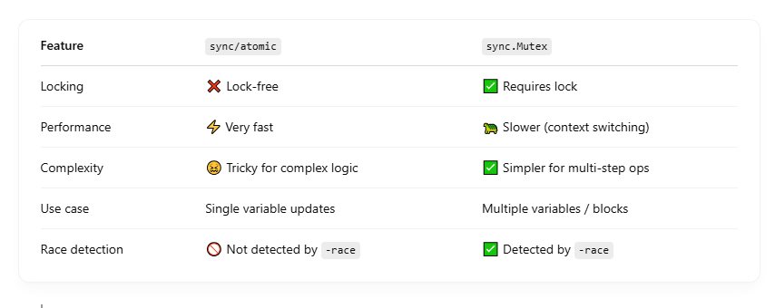

# 🧨 What is an Atomic Operation?

- An atomic operation is:
  - Indivisible — it either completes entirely or doesn’t happen at all.
  - Safe from race conditions — even across multiple threads.
  - Faster than mutexes — because it avoids context switching or kernel interaction.

## 🧰 Package sync/atomic

This package provides atomic load/store/add/compare-and-swap (CAS) operations for <br>

- int32, int64
- uint32, uint64
- uintptr
- unsafe.Pointer

## ⚙️ How It Works Internally

- Backed by hardware CPU instructions (LOCK CMPXCHG, XADD, etc.).
- Ensured via memory barriers — prevents reordering of reads/writes across CPUs.
- Ensures visibility across cores/threads without a lock.
- Go uses compiler intrinsics mapped to hardware instructions.

## ✍️ Common Atomic Operations

### 🧮 Increment / Decrement

```
import "sync/atomic"

var counter int64

atomic.AddInt64(&counter, 1)

```

This increments the counter safely, even with multiple goroutines. <br>

### 👓 Load / Store

```
val := atomic.LoadInt64(&counter) // read safely
atomic.StoreInt64(&counter, 100)  // write safely

```

These are memory-safe read/write operations — especially important in concurrent access scenarios. <br>

### 🔁 Compare-And-Swap (CAS)

```
if atomic.CompareAndSwapInt64(&counter, 100, 200) {
	fmt.Println("Value updated from 100 to 200")
}

```

- Atomically compares the value to 100.
- If equal, sets it to 200.
- Returns true if it succeeded, false otherwise.

This is a lock-free update pattern commonly used to build concurrent algorithms. <br>

## 🔒 Atomic vs Mutex



## 🧠 Rule of thumb:

- Use sync/atomic for simple counters or flags.
- Use sync.Mutex for multi-step or compound updates.

## 📦 Example: Atomic Counter

```
type AtomicCounter struct {
	val int64
}

func (c *AtomicCounter) Inc() {
	atomic.AddInt64(&c.val, 1)
}

func (c *AtomicCounter) Get() int64 {
	return atomic.LoadInt64(&c.val)
}

```
