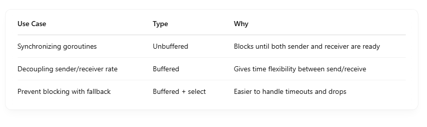
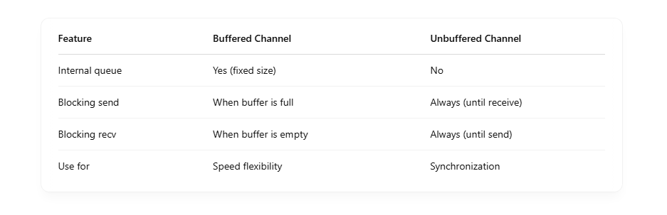

# 📬 What is a Channel in Go?

A channel is a typed conduit in Go used to send and receive values **between goroutines** <br>

Think of it like a pipe: <br>

- One goroutine sends a value into the pipe.
- Another receives the value from the pipe.

```
ch := make(chan int) // create a channel for int

```

## 🔁 How Channels Work Internally

- **Go channels are blocking by default:**
- A send operation **ch <- x blocks** until another goroutine receives from it.
- A receive operation **<-ch blocks** until another goroutine sends to it.

That’s how Go enables **synchronization and communication**. <br>

# Channel Under The Hood

## 💡 Summary First

- A core structure: hchan (runtime/hchan.go)
- Internal queues for senders and receivers, copy value into queue => pass by value
- Coordination via mutexes and semaphores
- Schedulers to block/unblock goroutines

## 🧱 1. What is hchan?

The internal Go struct for channels looks roughly like this (simplified): <br>

```
type hchan struct {
    qcount   uint           // number of elements in queue
    dataqsiz uint           // size of the circular buffer
    buf      unsafe.Pointer // buffer holding the data
    sendx    uint           // send index
    recvx    uint           // receive index
    recvq    waitq          // list of waiting receivers
    sendq    waitq          // list of waiting senders
    lock     mutex          // protects all fields
}

```

🔍 Some terms: <br>

- recvq/sendq: queues of goroutines waiting to receive/send
- dataqsiz: buffer size (0 = unbuffered channel)
- buf: the circular buffer for buffered channels
- sendx / recvx: indices to manage buffer rotation

## 📤 2. Sending to a Channel

When you do ch <- x, Go does: <br>

- Locks the channel (hchan.lock)
- Checks:
  - If receiver is waiting, hand off the value directly (zero-copy).
  - If buffered, add to the buffer at sendx.
  - If buffer full and no receiver → block the sending goroutine:
    - Save it to sendq
    - Suspend it (gopark)
- Unlocks the channel

✅ If a receiver is waiting, it’s woken up immediately (goready). <br>

## 📥 3. Receiving from a Channel

When you do x := <-ch, Go: <br>

- Locks the channel
- Checks:

  - If sender is waiting, take value directly from it.
  - If buffer has data, remove it from recvx.
  - If no sender/data → block the goroutine:
    - Save to recvq
    - Suspend (gopark)

- Unlocks the channel

✅ If a sender becomes available, it’s matched and woken up. <br>

## 🔁 4. Buffered Channels

- Use a circular queue (array) to store values.
- sendx and recvx are indexes into the buffer.
- Values are copied in/out of the buffer.

- **A buffered channel has a fixed-size queue (buffer) inside.**

### ✅ Behavior:

- Send: succeeds immediately if there's space.
- Receive: gets data from the buffer.
- If buffer is full, send blocks until space is freed.
- If buffer is empty, receive blocks until a value is sent.

```
ch := make(chan int, 2) // buffer size = 2

ch <- 1  // OK
ch <- 2  // OK
ch <- 3  // ❌ blocks because buffer is full

```

```
ch := make(chan int, 2)
ch <- 1 // put at buf[0], sendx++
ch <- 2 // put at buf[1], sendx++

<-ch    // take from buf[0], recvx++

```

Internally: There's a circular queue (hchan.buf) managed with sendx, recvx pointers. <br>

## 🛑 5. Unbuffered Channels

- No buffer. Communication only happens when both goroutines are ready.
- Value is directly transferred (zero-copy).
- One goroutine is parked until the other arrives.

- **An unbuffered channel has no storage.**
- Each send must wait for a corresponding receive, and vice versa.

### ❗ Behavior:

- Send blocks until a receiver is ready.
- Receive blocks until a sender sends.

```
ch := make(chan int) // unbuffered

go func() {
    ch <- 1 // waits until the main goroutine receives
}()

val := <-ch // receives 1 and unblocks sender

```

### 🔁 Analogy

📨 Unbuffered: <br>

- Like a direct phone call.
- You can't send a message unless the receiver picks up right now.

📨 Buffered: <br>

- Like leaving a voicemail.
- You can drop your message and the receiver can pick it up later.

### 🧠 Which to use?





## 🧠 Scheduler Interaction

When a goroutine is blocked: <br>

- gopark suspends the goroutine
- It’s added to sendq or recvq
- Another goroutine may resume it via goready
- Go scheduler (M:N) then handles moving it to a thread when ready

## ⚠️ Blocking / Deadlock Detection

At runtime, Go checks: <br>

- If all goroutines are asleep, and no one can make progress, you get:

```
fatal error: all goroutines are asleep - deadlock!

```

## 🚀 Real-World Impact

- Channel performance is very high but not free (locking, scheduler).
- Overusing channels for high-throughput workloads may introduce contention.
- Select, timeouts, and buffer sizes can help tune performance.

## 🧪 Want to See It Yourself?

You can inspect this in: <br>

- runtime/chan.go
- Use GODEBUG=scheddetail=1,asyncpreemptoff=1 to trace behavior
- Add profiling around channels to see blocking times
