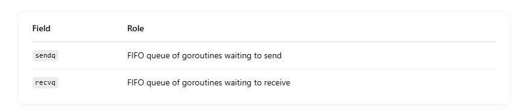
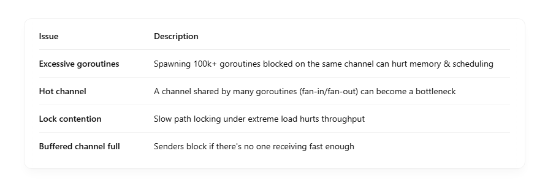

# How does Go handle channel contention and performance?

## 🔄 1. Fast Path (No Contention)

When there’s no blocking <br>

- A send operation on a channel succeeds immediately if:
  - For buffered channels: buffer isn't full.
  - For unbuffered channels: there’s already a goroutine waiting to receive.
- A receive operation completes immediately if:
  - For buffered: there’s something in the buffer.
  - For unbuffered: a goroutine is waiting to send.

🧠 Fast-path is optimized with no locking, just quick pointer math and memory writes. <br>

## 🕳️ 2. Slow Path (Contention)

When the fast path fails due to contention, Go takes the slow path: <br>

### 🔒 Locking with hchan.lock

- The channel is locked using a spinlock/mutex to safely modify the internal state (sendx, recvx, queues).
- This avoids race conditions between concurrent senders/receivers.

### 💤 Goroutine Parking

- If a goroutine can’t proceed:

  - It gets "parked" (suspended) and put into a queue (sendq or recvq).

- Once the channel is ready (e.g., buffer has space or a receiver shows up), the runtime wakes up a waiting goroutine.

These parked goroutines do not burn CPU — they are managed by Go’s scheduler. <br>

### 🧵 3. Goroutine Scheduler Efficiency

When contention is high: <br>

- The M:N scheduler still keeps things moving by:

  - Suspending goroutines blocked on channels.
  - Scheduling other runnable goroutines instead.

- This prevents deadlocks and starvation (unless you misuse channels badly).

## 🧠 Channel Queues Under the Hood

Internally, Go uses wait queues to manage contention: <br>


Both are implemented as intrusive linked lists, and Go uses lock-free tricks on fast paths. <br>

## 🚦 Optimization Techniques

Go uses several tricks to reduce contention: <br>

### ✅ 1. Double-check pattern:

Avoids locking unless it’s necessary: <br>

```
if buffer not full {
    // send without lock
} else {
    lock hchan
    check again...
    ...
}

```

### ✅ 2. Spinning:

- If a goroutine may be unblocked soon (microseconds), it might spin briefly before parking.

### ✅ 3. Batch Waking:

- Instead of waking just one goroutine, Go may batch wakeups to improve throughput.

## ⚠️ Performance Pitfalls to Watch



## 🧠 Tips to Avoid Contention

- Use buffered channels if producers are faster than consumers.
- Avoid a single shared channel for many goroutines — use sharded channels.
- Minimize channel use inside hot loops — may be better to use lock-free queues or atomic ops.
- Consider sync.Pool, sync.Cond, or manual queues for high-performance patterns.
