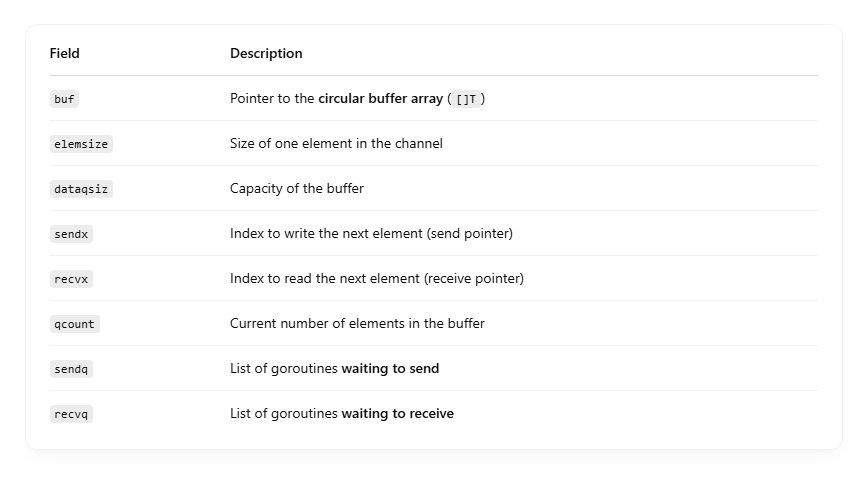

## 📦 Internals of a Buffered Channel in Go

Go channels are implemented as a struct called hchan in the Go runtime. <br>

For buffered channels, the hchan contains: <br>

## 🔧 Key Fields:



## 🔄 Circular Buffer Behavior

Imagine a ring buffer of size 3: <br>

```
Index:     0     1     2
          [ ]   [ ]   [ ]  ← buf (buffer of capacity 3)

```

### 📥 When Sending:

- Write at sendx, then increment sendx (wrap around using % dataqsiz).
- Increment qcount.

## 📤 When Receiving:

- Read from recvx, then increment recvx (also wrap around).
- Decrement qcount

## 💡 Example

```
ch := make(chan int, 3)

```

### Internally:

```
hchan {
  buf:     [0]int{_, _, _},
  sendx:   0,
  recvx:   0,
  qcount:  0,
  dataqsiz: 3,
}

```

### 👇 After ch <- 1:

```
buf[0] = 1
sendx = 1
qcount = 1

```

### 👇 After ch <- 2:

```
buf[1] = 2
sendx = 2
qcount = 2

```

### 👇 After <-ch:

```
value = buf[0] → 1
recvx = 1
qcount = 1

```

## 🧠 Summary

- Go’s buffered channels use a ring/circular buffer.
- sendx and recvx track where to write/read next.
- It’s lock-based (hchan.lock) and highly optimized in runtime.
- If buffer is full/empty, Go parks the goroutine in sendq or recvq.
