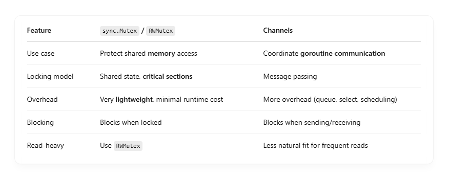

# 🔐 What is a sync.Mutex?

- sync.Mutex (short for mutual exclusion) is a low-level synchronization primitive that protects shared data from concurrent access

## ✅ How it works:

- Only one goroutine can lock it at a time.
- If another goroutine tries to Lock() while it’s held, it blocks until it’s released (Unlock()).

```
var mu sync.Mutex
var counter int

func increment() {
	mu.Lock()
	counter++
	mu.Unlock()
}

```

Without the mutex, multiple goroutines might race to update counter at the same time — causing incorrect values. <br>

## 🔁 What is a sync.RWMutex?

- sync.RWMutex is like Mutex but allows multiple readers or one writer — great for read-heavy workloads.

### ✅ Behavior:

- RLock() → allows multiple readers concurrently.
- Lock() → blocks readers and writers until the writer finishes.

```
var mu sync.RWMutex
var data map[string]string

func readData(key string) string {
	mu.RLock()
	defer mu.RUnlock()
	return data[key]
}

func writeData(key, val string) {
	mu.Lock()
	data[key] = val
	mu.Unlock()
}

```

## 🆚 Channels vs Mutex/RWMutex



### 🔧 When to Use Mutex/RWMutex:

- You have shared state (e.g., map, slice, counter).
- Reads/writes must be mutually exclusive.
- Performance-critical sections (mutexes are faster than channels).
- Simple access control — no need for message coordination

### 📦 When to Use Channels:

- You’re passing data between goroutines.
- You want to coordinate work (e.g., worker pools, pipelines).
- You want to avoid shared memory entirely (Go’s motto: "Do not communicate by sharing memory, share memory by communicating").

## Quick Mental Rule

- 🧠 Use sync.Mutex when you need to protect shared memory.
- 📡 Use channels when goroutines need to talk to each other or pass data.
