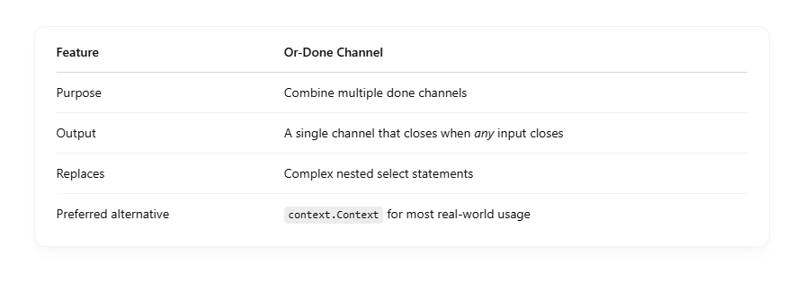

# 💡 What Is an Or-Done Channel?

An or-done channel: <br>

- Closes as soon as any of the input done channels is closed.
- Used to propagate cancellation across goroutines.

🧠 If you have multiple goroutines or contexts, and any one of them cancels, the or-done channel cancels too. <br>

## 📦 Real-World Use Case

- You’re listening to multiple cancel signals (timeouts, client disconnect, parent context cancel, etc.)

- You want a single point to know when to stop processing.

## 🛠 Implementation of Or-Done

Here’s a reusable or function that takes multiple <-chan struct{} channels and returns a new one that closes when any of them is closed: <br>

```
func or(channels ...<-chan struct{}) <-chan struct{} {
	switch len(channels) {
	case 0:
		return nil
	case 1:
		return channels[0]
	}

	orDone := make(chan struct{})

	go func() {
		defer close(orDone)

		switch len(channels) {
		case 2:
			select {
			case <-channels[0]:
			case <-channels[1]:
			}
		default:
			select {
			case <-channels[0]:
			case <-channels[1]:
			case <-channels[2]:
			case <-or(append(channels[3:], orDone)...): // recursion
			}
		}
	}()

	return orDone
}

```

## 🔍 Why It's Useful

- Used with pipelines to terminate long chains of goroutines when one is canceled.
- Common in context propagation, though context.Context now handles this pattern natively.

## ✅ With context.Context (Preferred in modern Go)

```
ctx, cancel := context.WithCancel(context.Background())

go func() {
    <-ctx.Done()
    fmt.Println("Canceled via context!")
}()

cancel() // triggers cancellation

```

## 🧠 Summary


