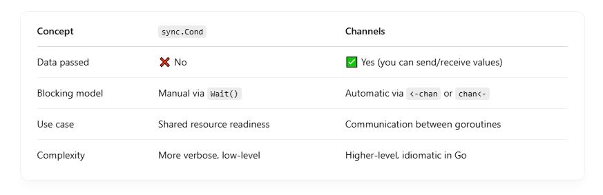

## 🔧 What is sync.Cond?

- sync.Cond is a condition variable — used to coordinate goroutines waiting for a shared condition to become true.

Think of it like: <br>

- "Hey, wait here until something changes. When it does, I’ll wake you up."

## ✍️ Usage Pattern

```
var mu sync.Mutex
cond := sync.NewCond(&mu)
queue := []int{}

go func() {
	mu.Lock()
	for len(queue) == 0 {
		cond.Wait() // Wait for signal
	}
	item := queue[0]
	queue = queue[1:]
	mu.Unlock()
	process(item)
}()

// In another goroutine:
mu.Lock()
queue = append(queue, 42)
cond.Signal() // Wake up one waiting goroutine
mu.Unlock()

```

## 🚨 Important:

- You must lock the mutex before calling Wait().
- Wait() releases the lock and blocks.
- When signaled, it relocks the mutex before returning.

## 🛠 Key Methods


## 🆚 How Is It Different from Channels?



## 🧠 When to Use sync.Cond

- You need multiple goroutines to wait for a shared state.
- You're implementing complex coordination, like:

  - Producer-consumer queues
  - Condition-based resource access
  - Manual wakeup of blocked goroutines

## 🔍 Real World Example

```
type Buffer struct {
	mu    sync.Mutex
	cond  *sync.Cond
	queue []int
	limit int
}

func NewBuffer(limit int) *Buffer {
	b := &Buffer{limit: limit}
	b.cond = sync.NewCond(&b.mu)
	return b
}

func (b *Buffer) Put(val int) {
	b.mu.Lock()
	for len(b.queue) == b.limit {
		b.cond.Wait()
	}
	b.queue = append(b.queue, val)
	b.cond.Signal() // Wake one consumer
	b.mu.Unlock()
}

func (b *Buffer) Get() int {
	b.mu.Lock()
	for len(b.queue) == 0 {
		b.cond.Wait()
	}
	val := b.queue[0]
	b.queue = b.queue[1:]
	b.cond.Signal() // Wake one producer
	b.mu.Unlock()
	return val
}

```

## 💡 Summary

- ✅ Use channels when you're passing values and can rely on Go's native blocking semantics.
- 🔧 Use sync.Cond for fine-grained synchronization, e.g. waiting for complex shared state or queue readiness.
