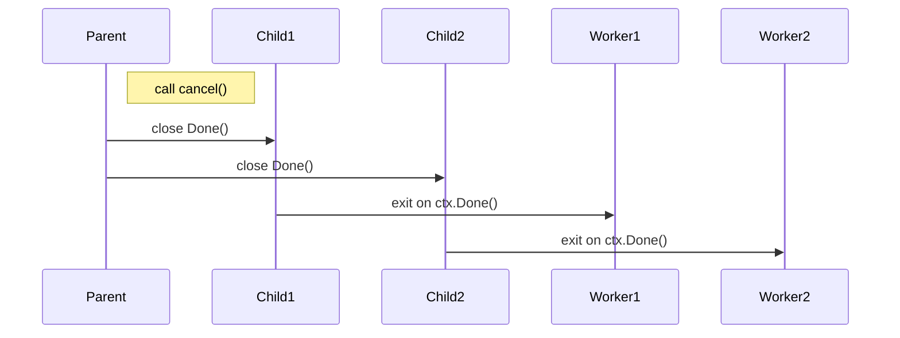
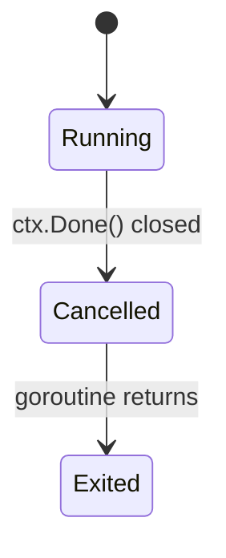

# 🧠 Deep Dive: Go `context` Package + Goroutines Interaction

## 🧭 Overview

The `context` package in Go provides a way to **carry deadlines, cancellations, and request-scoped values** across API boundaries and goroutines. It is essential for **propagating control signals** like timeouts or manual cancellations in concurrent programs.

---

## 🔧 Core Use Cases of `context`

1. **Cancellation propagation**
2. **Timeouts and deadlines**
3. **Passing request-scoped data**

---

## 🧩 `context.Context` Interface

```go
type Context interface {
    Deadline() (deadline time.Time, ok bool)
    Done() <-chan struct{}
    Err() error
    Value(key any) any
}
```

- `Done()`: Returns a channel that's closed when the context is canceled or times out.
- `Err()`: Returns the cancellation reason (`context.Canceled`, `context.DeadlineExceeded`).
- `Value(key)`: Carries request-scoped values.

---

## 🛠️ Context Types in stdlib

### 1. `context.Background()`

- Root context.
- Never canceled.
- Use it as the base of your tree.

### 2. `context.TODO()`

- Placeholder context when you’re unsure what to use.

### 3. `context.WithCancel(parent)`

- Returns a derived context and a `cancel()` function.
- Manual cancellation.

### 4. `context.WithTimeout(parent, duration)`

- Cancelled automatically after duration.
- Also returns a `cancel()` function.

### 5. `context.WithDeadline(parent, time.Time)`

- Like `WithTimeout` but with fixed `time.Time`.

### 6. `context.WithValue(parent, key, val)`

- Attaches key-value data to the context tree.

---

## 🌱 Context Propagation Tree

```mermaid
graph TD
    A[context.Background()] --> B[WithCancel]
    B --> C[WithTimeout]
    C --> D[WithValue: userID=123]
```

This shows how contexts **form a tree structure**, and cancellation flows **downwards**.

---

## ⚙️ Goroutines + Context

### Example: Canceling a Goroutine

```go
func worker(ctx context.Context, id int) {
    for {
        select {
        case <-ctx.Done():
            fmt.Printf("Worker %d stopped: %v\n", id, ctx.Err())
            return
        default:
            fmt.Printf("Worker %d is working...\n", id)
            time.Sleep(500 * time.Millisecond)
        }
    }
}

func main() {
    ctx, cancel := context.WithCancel(context.Background())
    defer cancel()

    for i := 0; i < 3; i++ {
        go worker(ctx, i)
    }

    time.Sleep(2 * time.Second)
    cancel() // Cancel all workers
    time.Sleep(1 * time.Second)
}
```

### Output:

```
Worker 0 is working...
Worker 1 is working...
Worker 2 is working...
...
Worker 2 stopped: context canceled
Worker 0 stopped: context canceled
Worker 1 stopped: context canceled
```

---

## 🔍 How Context Works Internally (Simplified)

### Cancellation Propagation

When you call `cancel()` on a child context:

- It **closes the `Done()` channel**
- The **signal propagates to all descendants**
- Goroutines listening on `Done()` detect this and **gracefully exit**



---

## 🔬 What Happens Under the Hood

- Each `Context` struct has a list of child contexts.
- When `cancel()` is called:
  - It sets `err = context.Canceled`
  - Closes the `done` channel
  - Recursively cancels all children
- Internally uses:
  - Mutex for locking child maps
  - Atomic ops to avoid double cancels

---

## 💡 Best Practices

✅ Use `context` for:

- Server timeouts
- Graceful shutdowns
- Canceling concurrent operations
- Request tracing

🚫 Avoid:

- Storing large values with `WithValue`
- Passing context to constructors or long-lived structs

---

## 🔄 Goroutine Life Cycle with Context



- **Blocking operations** (e.g. `select`, `http`, `db`) should watch `ctx.Done()`.
- Leaking goroutines often happen when you **don’t cancel** context or **don’t listen** to `Done()`.

---

## 🧪 Real Example: HTTP Request with Timeout

```go
func handler(w http.ResponseWriter, r *http.Request) {
    ctx, cancel := context.WithTimeout(r.Context(), 2*time.Second)
    defer cancel()

    result := make(chan string)
    go func() {
        // simulate long operation
        time.Sleep(3 * time.Second)
        result <- "done"
    }()

    select {
    case res := <-result:
        fmt.Fprintf(w, res)
    case <-ctx.Done():
        http.Error(w, "timeout", http.StatusGatewayTimeout)
    }
}
```

---

## 📊 Summary Table

| Feature       | Description                               |
| ------------- | ----------------------------------------- |
| `WithCancel`  | Manual cancelation of goroutines          |
| `WithTimeout` | Automatic cancel after duration           |
| `Done()`      | Channel to signal cancellation            |
| `Err()`       | Reason for cancel (`Canceled`, `Timeout`) |
| `WithValue`   | Attach metadata to requests               |
| `Propagation` | Cancel flows from parent to all children  |

---

## 🚪 Graceful Shutdown Example

```go
func main() {
    ctx, stop := signal.NotifyContext(context.Background(), os.Interrupt)
    defer stop()

    srv := &http.Server{Addr: ":8080"}

    go func() {
        <-ctx.Done()
        log.Println("shutting down gracefully...")
        srv.Shutdown(context.Background())
    }()

    log.Fatal(srv.ListenAndServe())
}
```

---

## 🔚 Closing Thoughts

The `context` package is Go’s built-in way to **control and coordinate concurrent operations**.

Understanding its **tree structure**, **cancellation model**, and how it interacts with **goroutines** is key to writing scalable and robust Go programs.

> “Don't leak goroutines. Use context.”
