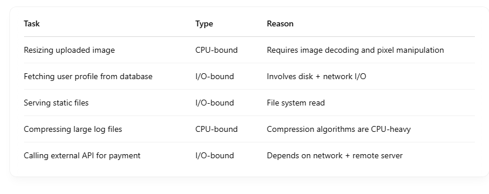
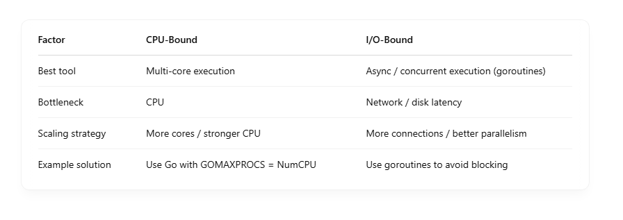
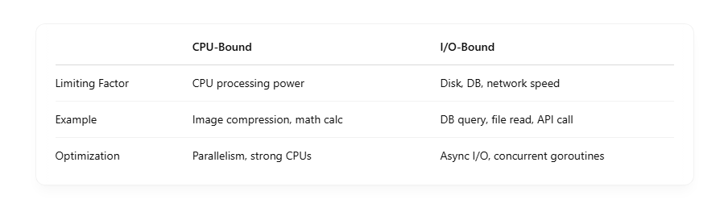

## 🧠 What is GOMAXPROCS?

GOMAXPROCS controls the maximum number of OS threads (P, processors) that can execute Go code simultaneously. <br>

### 🔧 How to Set It

```
import "runtime"

runtime.GOMAXPROCS(n) // Set it dynamically

```

### Case 1: GOMAXPROCS = 1 <br>

Only one goroutine can run at a time, even on a multi-core system. <br>

```
runtime.GOMAXPROCS(1)

```

- Good for debugging.
- Bad for CPU-bound performance.

### Case 2: GOMAXPROCS = 4 on 4-core CPU

- **Four goroutines can run in parallel, one per core.**

- Great for parallel CPU-bound tasks.
- More efficient use of hardware.

## ⚙️ Under the Hood: GOMAXPROCS & the Go Scheduler

Go uses the G-M-P model: <br>

- G: Goroutine
- M: OS thread
- P: Processor — represents logical CPU (not physical core)

GOMAXPROCS = N means: <br>

- The runtime creates N P objects.
- Only N goroutines can be actively scheduled onto M at once.
- M’s without a P are idle and can’t run Go code.

# 📊 Performance Impact

## ✅ When tuned properly:

- You get maximum CPU utilization.
- Higher throughput for CPU-bound tasks.
- Lower latency for concurrent I/O workloads.

## ❌ When too high:

- More context switching
- Memory pressure and GC pauses.
  Diminishing returns after number of physical core

# 🧠 1. What is a CPU-bound task?

- A CPU-bound task is limited by the speed of the processor (CPU). It does intensive computation, and spends most of its time using the CPU.

## 🔧 Examples:

- Image or video processing (e.g., resizing, transcoding)
- Cryptographic operations (e.g., JWT signing, hashing)
- Data transformation (e.g., converting large CSVs to JSON)
- Mathematical simulations or calculations (e.g., machine learning inference)

## 🔄 Characteristics:

- Uses high CPU continuously
- Adding more cores or threads can speed it up
- Scaling often requires more processing power

# 🌐 2. What is an I/O-bound task?

- An I/O-bound task is limited by how fast data can be read/written from an external source — like disk, database, network, etc.

## 🧩 Examples:

- Making HTTP requests to other services (REST, gRPC)
- Reading/writing files from disk or cloud storage (S3, Azure Blob)
- Querying databases (PostgreSQL, MongoDB)
- Reading from Kafka, Redis, or external APIs

## 🔄 Characteristics:

- Spends most time waiting for I/O
- CPU is idle while waiting
- Can scale efficiently with async / concurrency

# 🧪 Backend Example Comparison



# ⚙️ Why It Matters in Backend



# 💡 In Go (Golang):

- **Goroutines are perfect for I/O-bound tasks because they're lightweight and non-blocking.**

- **For CPU-bound tasks, Go benefits from GOMAXPROCS and concurrency, but only up to the number of physical cores.**


