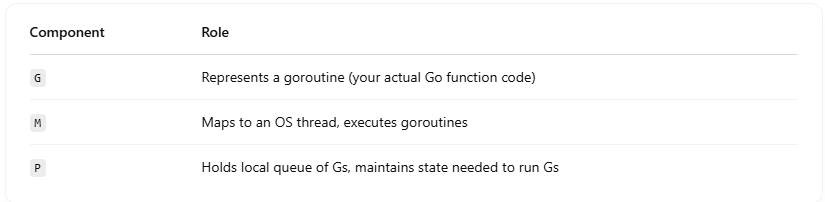

# 🔢 What is M:N Scheduling?

- "M:N" means M goroutines (user-level threads) are multiplexed onto N OS threads.
- It’s different from 1:1 (like in Java or C++ where each thread maps to one OS thread), or N:1 (like old green-threaded models).

## 🔹 In Go’s terms:

- G = Goroutine (lightweight user-level thread)
- M = Machine (OS thread)
- P = Processor (scheduling context – Go manages how work is assigned to M via P)

## 📌 So, Go implements:

```
Many Goroutines (G) ↔ Few OS Threads (M)
Managed by a fixed number of P (Processors)

```

## 🧠 Why M:N?

Because creating OS threads is expensive, and goroutines are cheap. Goroutines take only a few KB of stack (growable), so Go can handle hundreds of thousands without hurting performance.

## 🧰 Go Runtime: M:N with P

Here’s how Go handles M:N with its G-M-P Model: <br>



### Flow:

- A goroutine (G) is created.
- Go scheduler assigns it to a P (Processor).
- An M (OS thread) attached to that P runs the goroutine.

If a goroutine blocks (e.g., network I/O), the M can be parked and another M pulled from a pool to take over. <br>

## 🎯 Real-World Example

Let’s say: <br>

- You create 100,000 goroutines.
- Your CPU has 8 cores → GOMAXPROCS = 8 → Go creates 8 Ps.
- Go runtime uses, say, 8–20 Ms (OS threads) depending on blocking.

So <br>

- 100,000 goroutines (G) → distributed over 8 processors (P) → run on ~8–20 threads (M)
- Efficient, concurrent, and scalable.

## 🔁 Diagram Overview

```
[G1]  [G2]  [G3]   ...         (goroutines)
 ↓     ↓     ↓
[P1]  [P2]  [P3]   ...         (processors with run queues)
  ↘     ↓     ↙
   [M1] [M2] [M3]              (OS threads)

```

- Goroutines are queued on Ps.
- Ms pick Gs from Ps and run them.
- Blocking I/O handled by parking M and assigning a new one from the thread pool.
- Run many lightweight goroutines on fewer threads
- Reduce memory usage and context switching
- Provide high performance concurrency without the overhead of threads
