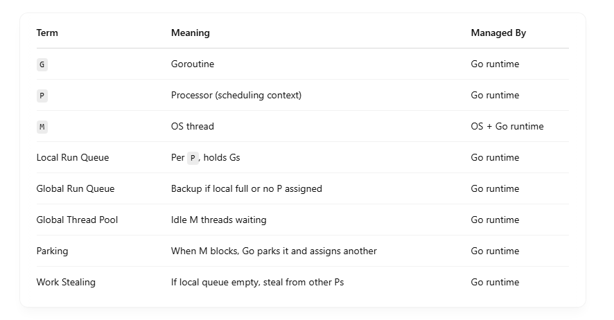
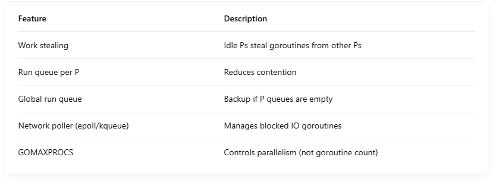

# How does Go schedule goroutine

Go’s goroutine scheduler is one of the core reasons Go can scale to millions of concurrent tasks efficiently — it’s a work-stealing, non-preemptive cooperative scheduler built into the Go runtime, not the OS. <br>

## 🧱 Key Concepts: The M:N Scheduler

Go uses an M:N scheduling model: <br>

- M = OS Threads (machine threads)
- N = Goroutines (green threads)
- P = Processors (logical CPUs managed by Go)

### 🔺 Mapping:

Many G (goroutines) are scheduled on M (threads), managed by P.

## 🧵 STRUCTURAL OVERVIEW

```
+-------------+    +----------+    +-------------+
|   Goroutine | -> |    P     | -> |     M       |
|     (G)     |    | RunQueue |    |  OS Thread  |
+-------------+    +----------+    +-------------+

```

## ⚙️ Components of the Go Scheduler

### 1. G (Goroutine)

- A lightweight function execution unit.
- Has its own stack (~2 KB, dynamically grows).
- Waiting, running, or ready to run.

### 2. M (Machine/OS Thread)

- Actual thread running on the OS.
- Executes goroutines.

### 3. P (Processor)

- A logical processor; manages a run queue of goroutines.
- Binds with M to run goroutines.
- The number of Ps = GOMAXPROCS (default: number of CPU cores).

# 🚦 Scheduling Steps (Simplified):

## 1.Startup:

- Go runtime initializes P processors.
- Each P has its own queue of runnable G goroutines.

## 2.When you call go fn():

- A new goroutine (G) is created.
- It’s pushed onto the local queue of the current P

## 3.M gets assigned to a P:

- Go has a fixed number of P (equal to GOMAXPROCS).
- Each M must acquire a P to run goroutines.
- Once M has a P, it pulls a G from P’s local run queue and runs it.
- If no G is available, it tries to steal work from other P’s queues (work stealing).
  - Randomly picks another P.
  - If that P has runnable goroutines, it steals half of them.
  - Now it can continue executing goroutines.

### 🔍 What is a Local Run Queue?

- Each P has its own queue of runnable goroutines.
- It avoids global contention (since each P has its own queue).
- Max length: usually 256 goroutines.

## 4.If goroutine blocks (e.g., I/O):

- That M may be parked.

  - G makes a system call (e.g., reads from socket).
  - Go runtime detects that it will block the thread.

    - M is parked (put to sleep, not used).
    - The P is detached from M and put back into the pool.
    - A new or reused M from global thread pool is assigned to the now-free P.

    - ### What is Parking?
    - Temporarily deactivating an M while it waits on a blocking operation.

- Another M is pulled from a global thread pool to take over the P.

  - ### What is the Global Thread Pool?
        - A pool of idle OS threads (Ms) maintained by Go runtime.
        - When one M blocks (e.g., due to syscall), Go can wake or create another M from the pool to keep execution going.

## 5.When goroutines become unblocked (e.g., netpoll):

- They're placed back into a P’s queue or a global run queue.
  - netpoller (based on epoll or kqueue) informs Go runtime.
  - Unblocked goroutine is pushed back into:
    - The original P's local run queue (if not full), or
    - The global run queue (backup)

## 🔄 All Components Working Together

```
+------------------+       +-----------------+        +----------------+
| Goroutine (G)    |       | Processor (P)   |        | Machine (M)    |
+------------------+       +-----------------+        +----------------+
| Runs business    | <---> | Holds local run | <--->  | OS thread, runs|
| logic code       |       | queue of Gs     |        | Gs from P      |
+------------------+       +-----------------+        +----------------+

            ↑                         ↑                           ↑
      [netpoll wakes]         [steal from P2]              [create new M if P1's M blocked]


```

## ✅ Summary Table



## 🔄 Example Timeline

```
Time →  | goroutine A running → blocked on IO | goroutine B running | ...
P1:     | G1 executed by M1                  | G2 executed by M1
P2:     | G3 executed by M2                  | G4 executed by M2

```

- When G1 blocks on IO, M1 parks.
- Another M may be used to run G2 if available.
- When G1's IO completes, G1 is enqueued back on a P’s run queue.

## 📈 Performance Features



## 🛠 Tools to Observe Scheduling

- runtime.NumGoroutine() — shows active goroutines
- GODEBUG=schedtrace=1000 — scheduler trace logs
- pprof — profile goroutine states
- go tool trace — visualize goroutine events and runtime behavior

## 📌 Summary

- Go maps many goroutines to fewer OS threads via the runtime.
- It uses M:P:G scheduling with local queues and work stealing.
- Preemption, async I/O via netpoll, and tight runtime integration make it highly efficient for concurrency.
