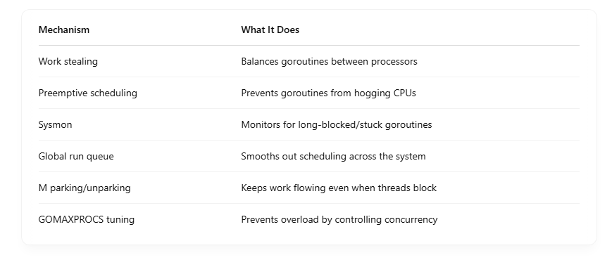

## 🔄 What is Goroutine Starvation?

Starvation happens when some goroutines are never scheduled to run, because others are hogging CPU time or scheduler resources.  

For example: If some goroutines are always CPU-bound and never yield, others may never get a chance to execute.  

# 🧠 How Go Prevents Starvation

## 1. 🔁 Work Stealing

- Each Processor (P) has its own local run queue of goroutines.
- If a P runs out of goroutines, it tries to steal from other Ps.

✅ This helps balance the load and avoids Ps sitting idle while others are overloaded.  

## 2. ⏰ Preemptive Scheduling (as of Go 1.14+)

- Go's scheduler periodically preempts long-running goroutines (e.g., tight infinite loops).
- This prevents a CPU-bound goroutine from monopolizing a P.

🛠 How?  

- Go injects preemption points into the code (safe places like function calls, loops, etc.).
- If a goroutine runs for too long, the runtime forces it to yield.
- 🧠 This was added in Go 1.14 and massively improved fairness.

## 3. 🛌 System Monitor (sysmon)

- A background goroutine that watches for:

  - Long-running goroutines
  - Stuck threads
  - Network poller responsiveness

- Helps detect goroutines that are sleeping too long or waiting too long for scheduling.

🔍 Think of it as a watchdog that helps avoid starvation and resource waste.  

## 4. 🔀 Global Run Queue Balancing

If local run queues are too unbalanced, Go occasionally pushes/pulls goroutines from the global run queue to/from local queues.  

This ensures:  

- Busy Ps don’t get overwhelmed.
- Idle Ps don’t stay idle.

## 5. 🧵 Thread Parking/Unparking

- If an OS thread (M) is blocked (e.g., on I/O), Go parks it.
- The scheduler assigns a new thread (M) to take over its P so work keeps flowing.

## 6. 🧊 GOMAXPROCS Respect

- GOMAXPROCS controls how many Ps (logical CPUs) are available.
- Go ensures fair scheduling among them.

🔧 You can tune this to ensure CPU-bound goroutines don’t overwhelm the system.  

## ✅ Summary: How Go Prevents Starvation

