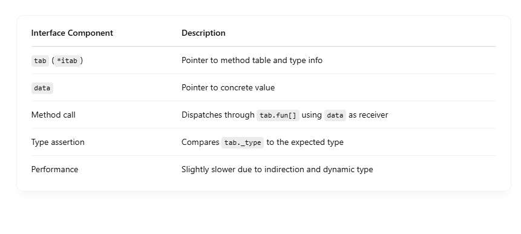

## 🧱 High-Level View: What is an Interface in Go?

At runtime, an interface in Go is a fat pointer — a pair of pointers internally: <br>

```
type iface struct {
    tab  *itab    // type + method table
    data unsafe.Pointer // pointer to the actual data
}

```

So every interface value holds: <br>

- A pointer to type-specific method info (itab)
- A pointer to the concrete data (data)

## 🔍 What's Inside the itab?

The itab (interface table) is a structure the Go runtime builds to link interface types to concrete types. It contains: <br>

```
type itab struct {
    inter  *interfacetype // interface type info
    _type  *_type         // concrete type info
    hash   uint32         // for type switches
    fun    [N]uintptr     // method function pointers
}

```

So, the interface can: <br>

- Know what methods are required (inter)
- Know what concrete type it holds (\_type)
- Know how to call the methods (fun[])

## Example

```
type Speaker interface {
    Speak() string
}

type Dog struct{}

func (d Dog) Speak() string {
    return "woof"
}

var s Speaker = Dog{}

```

When you assign Dog{} to Speaker, the runtime: <br>

- 1.Looks up Dog’s method table for Speak
- 2.Stores the pointer to that method in itab.fun
- 3.Stores the Dog value’s pointer in data
- 4.Assigns both to the iface variable

So s.Speak() does: <br>

- 1.Follow tab to fun[0] → method pointer
- 2.Call the function using data as the receiver

## 🛠 Interface Call = Dynamic Dispatch

Calling a method on an interface: <br>

```
s.Speak()

```

Is similar to: <br>

```
(*itab.fun[0])(s.data)

```

## ⚠️ Interface Performance Gotchas

- Interface method calls are slower than concrete method calls:
  - Due to the indirection via itab and data
- Small concrete values stored in interfaces may get heap allocated (escape to heap).
- Type assertions (s.(Dog)) involve runtime type checks.
- Reflection (reflect.TypeOf(s)) uses the same \_type metadata.


