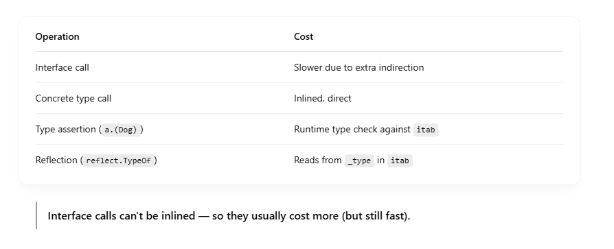

# 🧭 What is Interface Dispatching?

Interface dispatching is the process of figuring out which method to call when you're calling a method on an interface type — without knowing the concrete type at compile time. <br>

```
type Animal interface {
    Speak() string
}

type Dog struct{}
func (Dog) Speak() string { return "woof" }

func MakeNoise(a Animal) {
    fmt.Println(a.Speak()) // <-- dispatch happens here
}

```

When you call a.Speak(), Go doesn’t know statically that a holds a Dog. It has to resolve that at runtime. <br>

# 🔧 How Go Resolves Method Calls on Interfaces (Step-by-Step)

```
var a Animal = Dog{}
a.Speak()

```

Go does: <br>

### 1. Build an interface value

An interface in Go is internally: <br>

```
type iface struct {
    tab  *itab         // method table (type + methods)
    data unsafe.Pointer // pointer to concrete value
}

```

So a stores: <br>

- tab → contains the method pointers and type info for Dog
- data → contains a pointer to the Dog{} value

### 2. Use the method table to find the method

The itab contains a slice or array of function pointers, like this: <br>

```
type itab struct {
    inter  *interfacetype // interface type
    _type  *_type          // concrete type
    fun    [N]uintptr      // method table
}

```

At runtime, Go finds the correct method in fun[] using the method's offset/index in the interface definition. <br>

So a.Speak() translates roughly to: <br>

```
method := a.tab.fun[0]         // index for Speak()
call method with a.data        // method(a.data)
```

### 3. Call the method dynamically

It performs an indirect function call: <br>

```
funcPtr := a.tab.fun[0]
receiver := a.data

funcPtr(receiver)

```

## ⚠️ Performance Implications


