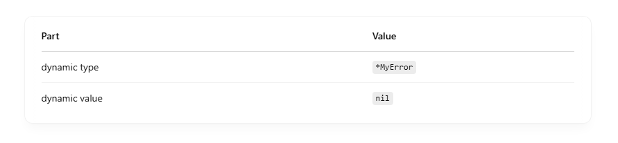
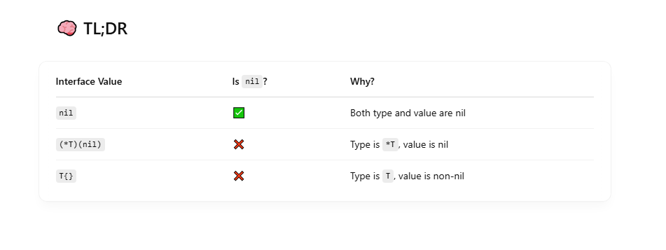

# Let’s break down why nil interface comparisons can fail, even when they look like they should work. <vr>

## 🧪 The Surprise

```
var err error = (*MyError)(nil)

if err == nil {
    fmt.Println("It's nil") // 🤔 NOT printed
} else {
    fmt.Println("It's NOT nil") // ✅ This runs
}

```

Wait… why is err not nil when it was assigned a nil pointer? <br>

## 🤯 The Key: Interface = (Type, Value)

In Go, an interface value is a 2-part structure: <br>

```
interface {
    dynamic type  // type info
    dynamic value // pointer to actual value
}

```

So when you assign (\*MyError)(nil) to err, you're doing this: <br>


This means: "err holds a non-nil type and a nil value". <br>

So err != nil, because Go checks both parts: <br>

```
err == nil  ⇨  err.type == nil && err.value == nil

```

## ✅ When is an interface actually nil?

Only when both the dynamic type and value are nil: <br>

```
var err error // default zero value → (nil, nil)

if err == nil {
    fmt.Println("Actually nil!") // ✅ This runs
}

```


