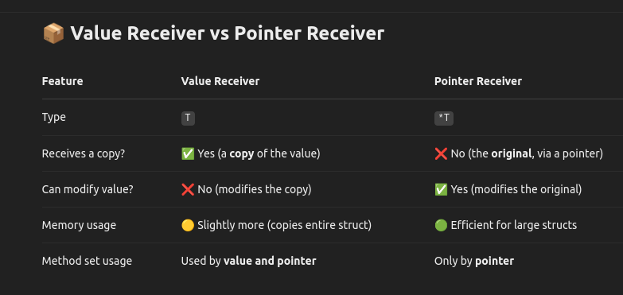

## Introduction

Awesome question — method receivers in Go (value vs pointer) are one of those things that look simple but have deep implications on behavior, especially in interfaces and method sets.

## What is a Method Receiver?

In Go, methods are functions that are bound to a type. <br>

```
func (r ReceiverType) MethodName() { ... }        // Value receiver
func (r *ReceiverType) MethodName() { ... }       // Pointer receiver

```



### 🔍 Key Behavior

#### 1. Modifying Struct Fields

```
type Counter struct {
    Count int
}

func (c Counter) IncrementValue() {
    c.Count++
}

func (c *Counter) IncrementPointer() {
    c.Count++
}

```

```
func main() {
    c := Counter{}
    c.IncrementValue()   // No effect
    fmt.Println(c.Count) // 0

    c.IncrementPointer() // Modifies original
    fmt.Println(c.Count) // 1
}

```

#### 2. Method Set Rules


```
type Person struct{}

func (Person) Hello()       {}  // Value receiver
func (*Person) Wave()       {}  // Pointer receiver

var v Person
var p *Person

v.Hello()   // ✅ OK
v.Wave()    // ❌ ERROR: cannot call pointer receiver on value

p.Hello()   // ✅ OK (Go auto-dereferences)
p.Wave()    // ✅ OK

```

#### ⚠️ Go doesn't auto-reference a value to call a pointer receiver, but does auto-dereference a pointer to call a value receiver.

## 📌 When to Use What?

### Use pointer receiver when:

- You need to modify the receiver.
- Your struct is large (avoid copying).
- You're working with interfaces (if method has pointer receiver, value won’t satisfy it).

### Use value receiver when:

- The method does not modify the receiver.
- Your struct is small (copying is cheap).
- You want consistency with built-in types (like time.Time uses value receivers).

## 🧠 Bonus: Interface Gotcha

```
type Speaker interface {
    Speak()
}

type Dog struct{}

func (d Dog) Speak() {
    fmt.Println("Woof")
}

func main() {
    var d Dog
    var p *Dog

    var s Speaker = d  // ✅ Works
    s.Speak()

    var s2 Speaker = p // ✅ Works (pointer method exists)
    s2.Speak()
}

```

But if Speak() was defined on \*Dog, then:

```
func (d *Dog) Speak() { ... }

var s Speaker = d  // ❌ ERROR: Dog does not implement Speaker (missing *Dog.Speak)

```
