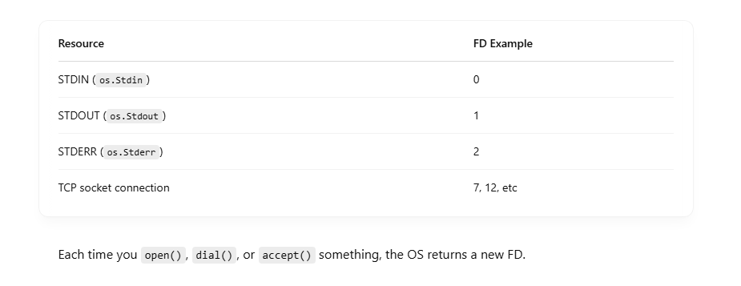

# 🔧 What is an FD (File Descriptor) in Go (and Unix-like OSes)?

## 🧠 FD = File Descriptor

- An FD (File Descriptor) is an integer used by the operating system to uniquely identify open files, sockets, pipes, etc.
- An FD (File Descriptor) is an integer used by the operating system to uniquely identify open files, sockets, pipes, etc.



## In Go

Under the hood, Go’s net.Conn, os.File, net.Listener, etc. wrap a file descriptor. You can even get it manually: <br>

```
f, _ := os.Open("somefile.txt")
fd := f.Fd() // returns uint64 file descriptor
fmt.Println(fd)

```

In case of net.Conn: <br>

```
conn, _ := net.Dial("tcp", "google.com:80")
tcpConn := conn.(*net.TCPConn)
rawConn, _ := tcpConn.SyscallConn()

rawConn.Control(func(fd uintptr) {
    fmt.Println("FD:", fd)
})

```

his prints the FD number assigned by the OS to the TCP socket. <br>

## 🔄 Why FDs Matter for Network Polling

Go uses non-blocking file descriptors to perform asynchronous I/O using epoll or similar systems. <br>

The FD is the key identifier the OS uses to: <br>

- Wait for it to become ready (read/write)
- Notify Go via the network poller

## 🧬 FD Lifecycle

```
net.Dial("tcp", "host:port")
       │
       ▼
    OS creates a socket
       │
       ▼
 Returns FD (e.g., 17)
       │
       ▼
Go adds FD 17 to poller (epoll/kqueue)

```

## 🔥 FD Limits

You can run out of FDs if your app opens too many files/sockets: <br>

```
ulimit -n  # check max number of FDs per process

```

# 📞 What is Dial in Go?

Dial is short for “dialing a connection”, like dialing a phone call. In Go, it’s how you initiate a network connection to a remote server — TCP, UDP, etc. <br>

## 🚀 Basic Usage

```
conn, err := net.Dial("tcp", "google.com:80")
if err != nil {
    log.Fatal(err)
}
defer conn.Close()

```

- "tcp" = the network protocol
- "google.com:80" = remote address and port

This creates a TCP connection to Google on port 80 (HTTP). <br>

## 🔍 Under the Hood

When you call net.Dial, Go does the following: <br>

- DNS resolution of google.com → IP address

- Creates a socket

- Performs a non-blocking connect syscall

- Wraps the connection in a net.Conn interface

- Returns that connection (or error)

```
net.Dial() → [ create socket ] → [ connect to IP:port ] → [ return conn ]

```

## 🧠 net.Conn Interface

The returned conn is of type net.Conn, which is an interface: <br>

```
type Conn interface {
    Read(b []byte) (n int, err error)
    Write(b []byte) (n int, err error)
    Close() error
    LocalAddr() Addr
    RemoteAddr() Addr
    SetDeadline(t time.Time) error
}

```
