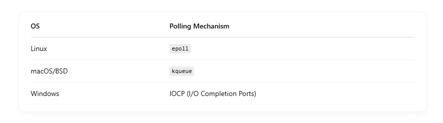
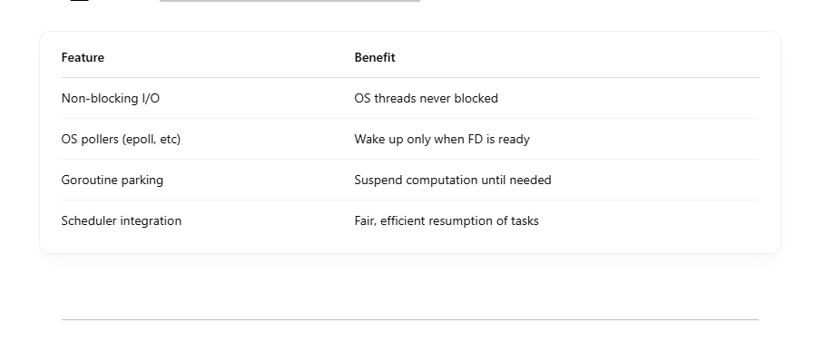

# How Go’s Runtime Poller Works

Go has its own built-in asynchronous network poller inside the runtime. It integrates with Go’s goroutine scheduler to ensure efficient multiplexing of many network operations onto a small number of OS threads. <br>

### 💡 Why It's Needed:

- Go's network operations (like net.Conn.Read or net.Conn.Write) are blocking from the programmer’s perspective, but internally, the runtime makes them non-blocking to scale.

- Without this, handling 10K concurrent requests would require 10K OS threads — which is infeasible.

## 🔧 How It Works Under the Hood

### 1. Syscalls Are Set to Non-blocking

When a network connection is created, Go marks its file descriptor as non-blocking using fcntl on Unix-like systems <br>

```
fd.SetNonblock()

```

This allows Go to: <br>

- Initiate I/O operations
- Avoid blocking the calling thread if data isn’t ready

### 2. Polling with epoll/kqueue/IOCP



The runtime poller: <br>

- Registers each file descriptor with the OS event loop
- Waits for "readable" or "writable" events
- Avoids spinning or sleeping inefficiently

### 3. Parking the Goroutine

If a goroutine tries to Read() from a socket and data is not ready: <br>

- The goroutine is parked (suspended)
- Its state is stored
- It's put in a wait list for that FD

No OS thread is blocked! <br>

### 4. Waking up Goroutines

When the poller gets an event from epoll or kqueue: <br>

- It wakes up only the specific goroutines waiting on that FD
- The goroutines are then resumed by the scheduler

Result: <br>

- No blocking threads
- Only goroutines that are ready to proceed get CPU time

## 🧠 Internals Flow Example

```
goroutine A → conn.Read()
            ↳ fd is non-blocking
            ↳ data not ready → runtime adds fd to epoll
            ↳ goroutine A parked

[... other goroutines continue ...]

epoll returns fd ready
↳ goroutine A unparked
↳ Read resumes and returns data

```

## 📦 Key Structures (in Go’s Runtime)

- pollDesc: internal struct holding FD state (ready, waiting, etc.)
- netpoller.go: handles OS integration
- runtime/netpoll.go: cross-platform wrapper

## 🧪 Result: High Concurrency with Low Threads

- You can handle 10K+ concurrent connections with just a few OS threads.
- Go’s goroutine scheduler + poller makes this seamless.
- This is why Go is so popular for web servers, proxies, and microservices.

# 🧠 High-Level Flow Diagram

## 1. Incoming TCP Connection

```
[ New TCP Conn ] ──────▶ [ http.Server Accepts Conn ]
                                 │
                                 ▼
                      [ conn.Read() in Goroutine ]

```

- A new client connects (e.g., a browser).
- http.Server accepts it and starts a goroutine to handle it.

## 2. Goroutine Tries to Read from Conn

```
[ Goroutine: handler ] ───────▶ conn.Read()
                                       │
             ┌─────────────────────────┘
             ▼
[ Is Data Available? ] ── No ──▶ [ Register FD with epoll ]
                                       │
                                       ▼
                              [ Park Goroutine (suspend) ]

```

- Go sets the file descriptor to non-blocking.
- If no data yet, it registers the FD with epoll or equivalent.
- The goroutine is suspended — no CPU wasted.

## 3. Runtime Poller Loop (in background)

```
[ runtime/netpoller ]
      │
      ├──▶ epoll_wait() / kqueue / IOCP
      │
      └── When data is ready:
             ▼
     [ Wake up matching goroutine ]

```

- The poller runs in a dedicated background thread.
- When the OS signals that a file descriptor is ready:
  - Go unparks the goroutine that was waiting.

## 4. Goroutine Resumes

```
[ Unparked Goroutine ]
         ▼
   [ conn.Read() resumes ]
         ▼
   [ Request is handled ]

```

## 🔄 Summary Diagram

```
┌────────────┐
│ TCP Socket │
└────┬───────┘
     │ accepted by http.Server
     ▼
┌────────────┐
│ Goroutine  │──────┐
└────┬───────┘      │
     │              │ No data yet?
     ▼              │
 [ conn.Read() ]────┘
     │
     ▼
 [ Register FD with epoll ]
     │
     ▼
 [ Park Goroutine ]

 [ OS signals ready ]
     │
     ▼
 [ Unpark Goroutine ]
     │
     ▼
 [ Read resumes, handler continues ]

```

```
package main

import (
    "fmt"
    "net"
    "net/http"
    "sync/atomic"
    "time"
)

var counter int64

func handler(w http.ResponseWriter, r *http.Request) {
    count := atomic.AddInt64(&counter, 1)
    fmt.Fprintf(w, "Request #%d\n", count)
}

func main() {
    http.HandleFunc("/", handler)

    // Limit OS threads to show goroutines > threads
    runtime.GOMAXPROCS(1)

    fmt.Println("Listening on :8080")
    http.ListenAndServe(":8080", nil)
}

```

Then in another terminal: <br>

```
# Run 1000 concurrent clients
hey -n 10000 -c 1000 http://localhost:8080

```

Or: <br>

```
ab -n 10000 -c 1000 http://localhost:8080/

```

Then in your app, use: <br>

```
runtime.NumGoroutine()

```

You’ll see 1000s of goroutines running with just 1-2 threads! <br>

## What Makes This Efficient



## 🎨 epoll Architecture: Visual Overview

```
           ┌──────────────────────────────────────────────┐
           │              Your Go/C App                   │
           └──────────────────────────────────────────────┘
                           │
        ┌──────────────────┼───────────────────┐
        ▼                                      ▼
  net.Dial / socket()                     Goroutines
        │                                      │
        ▼                                      ▼
 ┌───────────────┐                    ┌────────────────┐
 │   File Desc   │◀──────────────────│ net.Conn (FD)   │
 │     (FD)      │                    └────────────────┘
 └───────────────┘
        │
        ▼
┌──────────────────────────┐
│     epoll_ctl(ADD FD)    │ ─────────┐
└──────────────────────────┘          │ Registers socket FD
        │                             │
        ▼                             │
┌────────────────────────────┐        │
│     epoll_wait(timeout)    │◀───────┘
└────────────────────────────┘
        │
        ▼
┌────────────────────────────────────────────┐
│  Linux Kernel (OS)                         │
│  - Monitors sockets via epoll              │
│  - Uses efficient I/O polling mechanisms   │
│  - Wakes up epoll_wait() when ready        │
└────────────────────────────────────────────┘
        ▲
        │
        ▼
┌────────────────────────────┐
│ Ready FD returned to app   │
└────────────────────────────┘
        │
        ▼
┌────────────────────────────┐
│ Go runtime unparks goroutine│
│ and resumes handler         │
└────────────────────────────┘

```
