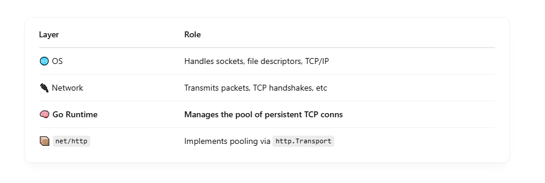
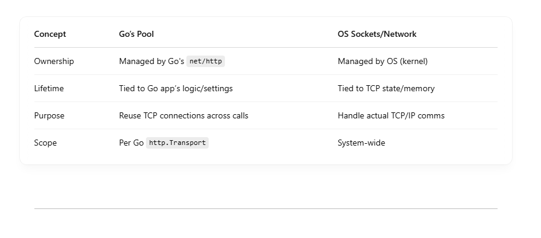
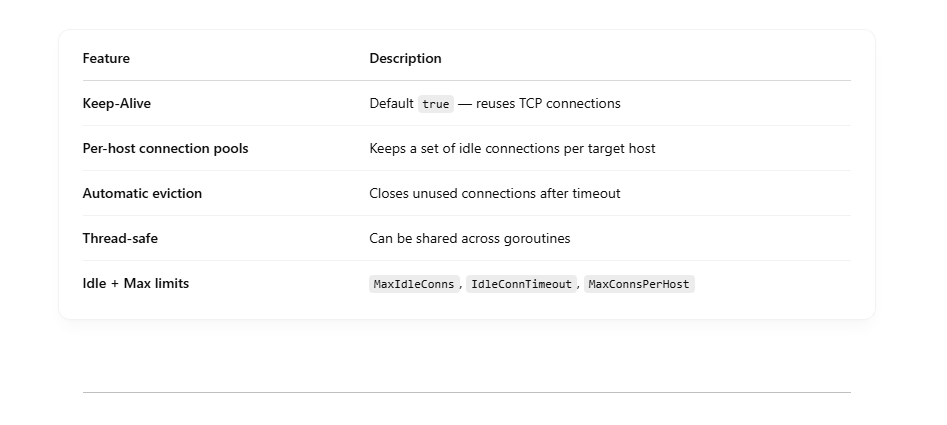
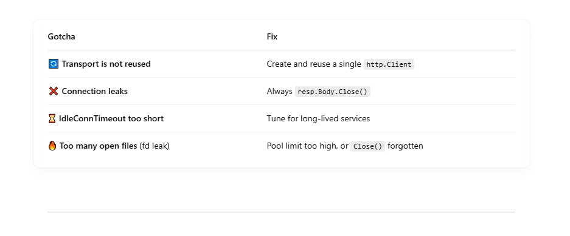
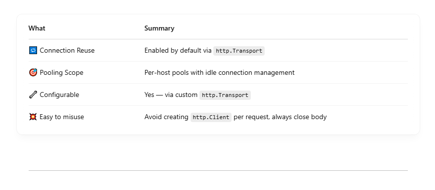

# 🏊‍♂️ What Exactly Is the “Pool” in Go's net/http?

- When we say "connection pool" in Go, we’re talking about an in-memory data structure managed by the Go runtime — specifically by the http.Transport inside your Go application.
- It’s not the OS. It’s not the network layer. It’s not something external like a database pool.
- **👉 It’s purely implemented inside your Go program, as part of the Go standard library.**

## ✅ So, who manages the connection pool?



The Go http.Transport layer is the one keeping track of: <br>

- Open TCP connections per host
- Which ones are idle
- Which can be reused
- When to close them (IdleConnTimeout)
- How many to keep open (MaxConnsPerHost, etc.)

## 📦 Where Is the Pool Stored?

- It lives in memory inside your Go process.
- Each http.Transport instance maintains its own per-host pool:

```
map[string][]*persistConn

```

where persistConn is an internal struct representing a live TCP connection. <br>

## 💡 Analogy: Connection Pool in Go vs OS



## ⚙️ Example Lifecycle

Let’s say you hit an API 1000 times/sec: <br>

- 🔌 First request → Go opens TCP connection via net.Dial
- ✅ Response received → Go keeps connection open
- 🕰️ 2nd request to same host → Go reuses the connection
- 🔁 After request completes → puts it in pool (idle)
- 🧹 If idle for too long → closed automatically
- 🔒 If pool is full → Go closes excess idle connections or blocks

All of this logic is inside the Go HTTP client's transport layer, and not visible to the OS beyond actual socket usage. <br>

## 📈 Does It Affect the OS?

Yes — indirectly: <br>

- More TCP connections open → more file descriptors used
- Idle connections still consume kernel resources
- Too many can hit OS socket limits (ulimit -n)
- That’s why you tune: <br>
  - MaxConnsPerHost
  - IdleConnTimeout
  - and clean up with resp.Body.Close()

## But again: the OS doesn’t manage the pooling — your Go app does. <br>

```
Go’s net/http package handles connection pooling automatically using its built-in http.Transport. It's one of the reasons Go's HTTP client is so performant out of the box — but it helps to know how it actually works so you can tune it for high-load scenarios.


```

# ⚙️ How Connection Pooling Works in net/http

The core of connection pooling lives in: <br>

```
http.DefaultTransport.(*http.Transport)

```

When you use http.Get(), http.Post(), or create a http.Client with default settings, you're using a shared Transport that: <br>

- Reuses TCP connections (keep-alive) across requests to the same host
- Keeps idle connections alive for a configurable time (default: 90s)
- Limits max idle connections per host and in total

```
[http.Client]
     |
     v
[http.Transport]
     |
     |--- Dial → net.Dial or custom Dialer
     |
     |--- Maintains per-host connection pool:
           Host:Port => []*persistConn

```

## ✅ Key Features of the Pool



## 🛠️ Customizing Connection Pool Behavior

```
client := &http.Client{
    Transport: &http.Transport{
        MaxIdleConns:        100,
        MaxIdleConnsPerHost: 10,
        IdleConnTimeout:     30 * time.Second,
        MaxConnsPerHost:     20,
    },
    Timeout: 5 * time.Second, // request timeout
}

```

## 🔹 Common Tunables:

- MaxIdleConns: Total idle conns across all hosts
- MaxIdleConnsPerHost: Idle connections per host
- MaxConnsPerHost: Total (active + idle) conns per host
- IdleConnTimeout: When to close idle conns
- TLSHandshakeTimeout: How long to wait for TLS setup

## ⚠️ Gotchas



## 💡 Best Practices

- ✅ Reuse a single http.Client (don’t create one per request)
- ✅ Tune the Transport for your concurrency/load pattern
- ✅ Always close response bodies to release the connection back to the pool
- ✅ Use context.Context or Timeout to avoid hanging requests
- ✅ In long-lived apps, monitor connection metrics

## 🔍 Real-World Example: High-Load Service

```
var httpClient = &http.Client{
    Transport: &http.Transport{
        MaxIdleConns:        500,
        MaxIdleConnsPerHost: 100,
        MaxConnsPerHost:     200,
        IdleConnTimeout:     90 * time.Second,
    },
    Timeout: 10 * time.Second,
}

```

## 🧠 TL;DR



# 🧠 1. Reuses TCP Connections (Keep-Alive)

HTTP/1.1 by default uses persistent connections via the Connection: keep-alive header.
This means instead of opening a new TCP connection for every HTTP request, Go will reuse an existing one if: <br>

- The request is to the same host:port
- The connection is still open and idle
- The server also supports keep-alive (almost all do)

## ✅ Why it matters:

- 🧠 Avoids TCP handshake (SYN, ACK, etc.)
- 🔐 Avoids full TLS handshake (expensive)
- ⚡️ Reduces latency & CPU
- 💸 Saves resources on client and server

## 💡 In Go:

Go handles this automatically in http.Transport. <br>

```
client := &http.Client{
    Transport: &http.Transport{
        // Keep-alive is on by default
    },
}

```

When you do: <br>

```
resp, _ := client.Get("https://example.com/data")

```

If a connection to example.com:443 is already alive and idle in the pool, it will reuse that TCP connection. <br>

# 🧠 2. Keeps Idle Connections Alive (Default: 90s)

## 🔍 What it is:

- Go does not immediately close a connection after a request finishes.
- It puts the connection back into a per-host idle pool, where it waits for reuse.
- This saves time on future requests, especially for high-throughput or bursty workloads.

## ⏲️ Default behavior:

```
IdleConnTimeout: 90 * time.Second // default

```

This means: <br>

- If a connection is unused for >90 seconds, it's closed
- If reused within 90s → instant reuse = faster requests

## 💡 Customize it:

```
&http.Transport{
    IdleConnTimeout: 30 * time.Second, // shorter lifetime
}

```

✅ Helps manage resource usage (file descriptors, memory) <br>

## 🧠 3. Limits Max Idle Connections (Per Host & Total)

### 🔍 Why limit?

- Without limits, a high-concurrency system could:
- Leave too many idle connections open
- Exhaust file descriptors (ulimit)
- Create GC pressure or hit OS/network limits

```
&http.Transport{
    MaxIdleConns:        100,  // Total idle connections across all hosts
    MaxIdleConnsPerHost: 10,   // Idle connections allowed per host
    MaxConnsPerHost:     20,   // NEW: max total (idle + active) per host
}

```

- **⚠️ If MaxConnsPerHost is reached, further requests to that host are queued until a connection frees up.**

## 🧪 How These Work Together (Example)

```
Transport{
    MaxIdleConns: 100,
    MaxIdleConnsPerHost: 10,
    MaxConnsPerHost: 20,
    IdleConnTimeout: 30 * time.Second,
}

```

Here’s what happens: <br>

- Up to 20 total connections to any host can be open simultaneously (active or idle)
- Of those, 10 can be kept idle when requests finish
- Any idle conn unused for 30s will be closed
- A new request to the same host:
  - Reuses an idle connection if available
  - Opens a new TCP connection if below 20
  - Otherwise waits until a conn frees up

## ⚠️ Real-World Impacts


