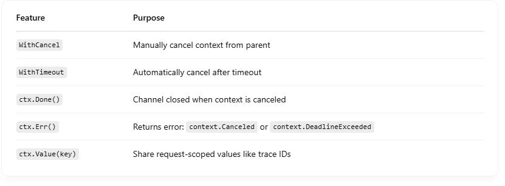

# ✅ What is context.Context?

context.Context is a standard interface in Go (context package) that: <br>

- Carries deadlines, cancellation signals, and request-scoped values.
- Allows one part of your code to control other goroutines.

## 🧠 Why Is It Important?

It's essential for: <br>

- Cancelling long-running operations
- Avoiding goroutine leaks
- Enforcing timeouts
- Sharing values like auth tokens, request IDs, etc.

## 🔧 Example Use Case

Imagine you're handling a web request that calls a slow database: <br>

```
func handleRequest(w http.ResponseWriter, r *http.Request) {
    ctx := r.Context()  // get context from HTTP request
    data, err := fetchFromDB(ctx)
    ...
}

```

Inside fetchFromDB(ctx), if the client disconnects or times out, ctx.Done() will signal and let your code stop waiting — preventing wasted resources. <br>

## 🧱 Core Methods of context.Context

```
type Context interface {
    Deadline() (time.Time, bool) // When should I timeout?
    Done() <-chan struct{}       // Closed when cancelled
    Err() error                  // Why was I cancelled?
    Value(key interface{}) any   // Optional: get context values
}

```

## 🛠️ Creating Contexts

✅ context.Background() <br>

- A root context, never cancels.
- Use this at the top level.

✅ context.WithCancel(ctx) <br>

- Creates a context you can manually cancel.

```
ctx, cancel := context.WithCancel(context.Background())
go func() {
    <-ctx.Done()
    fmt.Println("Cancelled:", ctx.Err())
}()
cancel()

```

✅ context.WithTimeout(ctx, time.Second) <br>
Automatically cancels after the given timeout. <br>

```
ctx, cancel := context.WithTimeout(context.Background(), 2*time.Second)
defer cancel()

```

🔁 Typical Long-Running Pattern <br>

```
func fetchFromDB(ctx context.Context) (string, error) {
    select {
    case result := <-slowQuery():
        return result, nil
    case <-ctx.Done():
        return "", ctx.Err() // e.g., context.DeadlineExceeded
    }
}

```

### This pattern prevents blocking forever — key in microservices, web servers, or anything async.

## 🚨 Without context

- You may leak goroutines if something waits forever.
- You waste memory and CPU on irrelevant work.
- You can’t gracefully cancel downstream ops.

## 🔑 Summary


