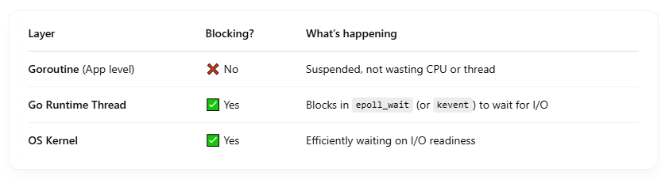
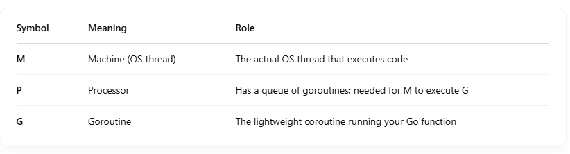

## 🔧 What Are epoll and kqueue?

- These are OS-level APIs for handling large numbers of I/O events efficiently without blocking on each one.


## 🧠 Why Do We Need Them?

Let’s say you’re writing a server that handles 10,000 connections: <br>

- With blocking I/O, you'd need 10,000 threads 😱
- With select/poll, you'd scan through a giant list every time — O(n)
- With epoll/kqueue, you tell the kernel:
  - "Let me know when something's ready", and only the ready ones are returned.

## ⚙️ How They Work (High-Level View)

### 🔁 epoll (Linux)

- epoll_create() → get a handle
- epoll_ctl() → register file descriptors (sockets, pipes, etc.)
- epoll_wait() → block until one or more fds are ready

```
int epfd = epoll_create(1);
epoll_ctl(epfd, EPOLL_CTL_ADD, sock_fd, &event);
epoll_wait(epfd, events, MAX_EVENTS, timeout);

```

### 🧩 kqueue (macOS/BSD)

- kqueue() → get handle
- kevent() → register interest
- kevent() → wait for readiness

## 🚀 How Go Uses Them for Async I/O

- Go uses non-blocking I/O under the hood combined with epoll/kqueue to implement its goroutine scheduler and netpoller

## Go Components:

- netpoller: Core runtime component (in Go runtime)
- pollDesc: Metadata wrapper around file descriptors
- runtime/netpoll.go: Implements event polling
- runtime/netpoll_epoll.go: Linux-specific epoll logic

## ⚙️ Detailed Flow in Go:

```
conn, _ := net.Listen("tcp", ":8080")
go handleConnection(conn)

```

- Go sets socket to non-blocking mode
- Registers the fd with epoll/kqueue using epoll_ctl or kevent
- Go’s runtime enters an event loop:

  - epoll_wait blocks
  - When I/O is ready (say: read on conn), OS wakes up Go runtime

- Go maps event to a goroutine:
- Stores where the goroutine left off (gopark)
- Resumes execution when event is ready (goready)
- This is how Go manages millions of concurrent connections without using millions of threads.

## ⚡️ Visualization

```
[ Goroutine ]
     |
     |   I want to read from socket X
     ↓
[ netpoller ]
     |
     |   epoll_ctl/kevent -> register socket X
     |
     ↓
[ OS Kernel ]
     |
     |  (waits for data)
     ↓
[ Data arrives ]
     |
     |  epoll_wait/kevent wakes up
     ↓
[ Go runtime schedules goroutine ]
     ↓
[ Goroutine resumes ]

```

## 🧠 Key Takeaways

- epoll/kqueue = async I/O notification systems at OS level
- Go integrates with these to power its efficient goroutine scheduling
- No blocking per connection — instead uses event-driven, non-blocking I/O
- Helps Go achieve massive concurrency with minimal threads

## ✅ Summary Statement

In Go, goroutines do not block. But the OS-level epoll_wait or kqueue call does block — and that’s perfectly fine <br>



## 🧠 Why It's Efficient

Let’s say you have 10,000 goroutines, each waiting on I/O (e.g., HTTP requests or DB reads): <br>

- Goroutines are parked (like sleeping green threads).
- The Go runtime uses only a few threads to manage them.
- One of those threads blocks in epoll_wait or kevent.
- When the OS sees that a socket is ready, it wakes up that thread.
- The Go scheduler then resumes only the goroutine(s) ready to continue.

This model gives you: <br>

- Low memory usage (because goroutines are small)
- High concurrency (not limited by OS threads)
- Minimal CPU usage when idle

## 💡 Analogy

Imagine a receptionist (Go runtime) with 10,000 guests (goroutines) waiting for packages (I/O). <br>

- Instead of checking every guest constantly (polling), the receptionist goes to sleep.
- The delivery service (OS kernel) rings the bell only when a package arrives.
- The receptionist wakes up, finds which guest it's for, and continues just with them.

## 🔬 Visualization

```
[ Goroutine 1 ] -- waiting to read
[ Goroutine 2 ] -- waiting to write
...
[ Goroutine N ] -- waiting for timeout

↓ Go runtime ↓

[ netpoller thread ]
   ⤷ blocks on epoll_wait()

↓ OS ↓

[ Kernel ]
   ⤷ handles hardware/network interrupts
   ⤷ when data ready → notifies epoll → wakes netpoller → resumes goroutine

```

## 🔄 How It Feels in Code

Even though you write: <br>

```
data, err := conn.Read(buf)  // this *looks* blocking

```

Under the hood: <br>

- If data isn't ready, Go parks the goroutine and registers the fd with epoll.
- No CPU is wasted.
- When data arrives, only then the goroutine is resumed.

# 🔁 First, The Components

## 1. Goroutine (🧵 Lightweight Thread)

- A goroutine is a function running concurrently in Go.
- Very cheap, uses ~2KB of stack initially.
- Scheduled and managed by the Go runtime.

```
go func() {
    conn.Read(buf)  // "Looks blocking", but is not
}()

```

## 2. Go Runtime (⛓️ The Engine)

The Go runtime is the internal engine that powers: <br>

- Scheduling goroutines on threads
- Garbage collection
- Timers
- I/O via netpoller

Think of it like the "mini-OS" that manages all goroutines efficiently. <br>

## 3. Netpoller (📡 I/O Waiter)

- A component inside the Go runtime
- Responsible for waiting on I/O using epoll (Linux), kqueue (macOS), or IOCP (Windows).
- It calls OS APIs like epoll_wait() to efficiently wait for file/socket readiness.

## No, the Go runtime ≠ processor P — the runtime is the entire system managing goroutines, including P, M, and G.

- P (Processor) is a key component of the Go runtime scheduler.
- It's the thing that lets Go run goroutines on OS threads.

## 🤹 Go Scheduler Model — MPG



## 🔁 How They Work Together:

- A goroutine (G) is your function (like go doWork()).
- To run, a goroutine needs:

  - A Processor (P) → it holds the scheduling context and run queue.
  - A Machine (M) → the actual OS thread.

```
G (goroutine) + P (processor) + M (OS thread) → execution

```

## 🎯 Responsibilities of Each

### 🔸 G (Goroutine):

- Your code: go func() { ... }
- Has a stack and state
- Super lightweight

### 🔸 M (Machine / OS thread):

- Maps directly to an OS thread (e.g., Linux thread)
- Used to execute goroutines
- Can block in system calls, epoll, etc.

### 🔸 P (Processor):

- Holds the run queue of goroutines
- Has memory caches (to avoid lock contention)
- Gives execution permission to M
