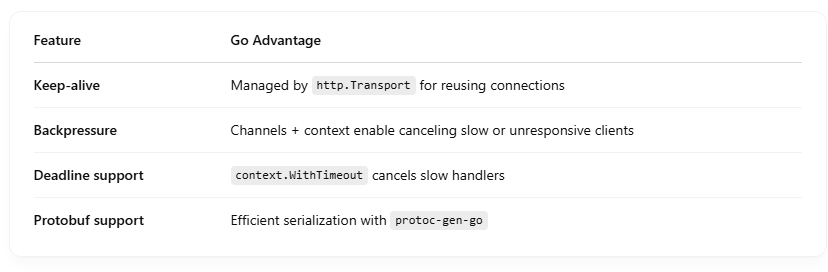

# How Golang Optimize WebSocket And GRPC

## 🔧 1. Goroutines and the Go Scheduler

Go's lightweight goroutines are perfect for managing thousands of concurrent WebSocket/gRPC connections because:  

- They use very little memory (initial ~2 KB stack).
- The Go runtime scheduler (M:P:G) maps goroutines efficiently to OS threads.
- Blocking I/O (like a slow client) doesn’t block the thread — just the goroutine.

✅ This gives massive concurrency without spawning OS threads  

## 🌐 2. Network Poller (epoll/kqueue/IOCP)

Go uses OS-level async I/O primitives:  

- Linux → epoll
- macOS/BSD → kqueue
- Windows → IOCP

Go’s internal netpoller allows the runtime to:  

- Suspend goroutines when a socket is idle.
- Resume only when data arrives (non-blocking).

✅ This avoids CPU waste and handles thousands of open sockets efficiently.  

## 📡 3. WebSocket Optimization (via net/http + gorilla/websocket)

When using WebSocket:  

- Handshake is done over net/http
- Upgrade to WebSocket with minimal overhead
- Each connection gets its own goroutine (e.g., one for reading, one for writing)
- Uses net.Conn, which integrates tightly with Go’s poller

If using gorilla/websocket:  

- It's optimized for buffered I/O and concurrent reads/writes
- You can enable compression (permessage-deflate) for bandwidth saving
- Ping/pong handling is built-in

✅ The Go model keeps CPU usage low even with 10k+ WebSocket clients.  

gRPC in Go uses HTTP/2, which supports:  

- Multiplexed streams over a single TCP connection
- Binary framing (efficient parsing)
- Flow control

Go’s google.golang.org/grpc library:  

- Uses goroutines per stream/request
- Manages keep-alives, deadlines, retries
- Handles streaming bidirectional RPCs efficiently

## 🔍 Internally:

- gRPC uses http2.Server from the standard library
- Efficient I/O with context cancellation, deadlines, and headers via context.Context

✅ Excellent performance, especially in microservice communication.  

## 💡 Other Optimizations

