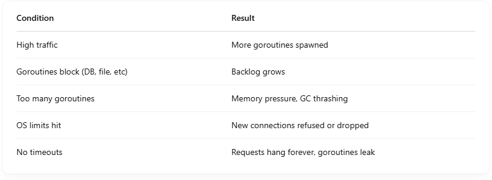

# What happen when Go HTTP Server run out of Goroutine

If a Go HTTP server "runs out" of goroutines handling requests, incoming requests will be blocked (queued by the OS or dropped), and latency spikes or timeouts can occur. However, Go doesn’t have a hard limit on the number of goroutines — the actual limit is based on available memory and CPU resources <br>

## 🧵 What really happens step-by-step:

### ✅ 1. Each incoming HTTP request is handled in its own goroutine:

```
http.HandleFunc("/", func(w http.ResponseWriter, r *http.Request) {
	go handleRequest(r) // spawned implicitly by net/http
})

```

The net/http package automatically spawns a goroutine per connection (and sometimes per request in HTTP/2). <br>

## 🔁 2. Go can handle millions of goroutines

- Goroutines are lightweight: ~2 KB stack, grows as needed.
- But they're not free — they consume memory and scheduler overhead.
- If you spawn too many and your system hits memory or CPU limits:
  - The scheduler slows down.
  - Garbage collection (GC) gets more expensive.
  - Eventually, you may get runtime: out of memory or OOM kill by the OS.

## 🚧 3. If all goroutines are busy (e.g., doing blocking I/O):

- New connections are accepted by the OS up to the listen backlog.
- Go accepts connections using epoll/kqueue and starts handlers.
- If goroutines are blocked (e.g., waiting on DB), the runtime queues new requests internally, but:

### 🧨 Eventually:

- The system memory runs out, or
- You hit max file descriptors (FD limit), or
- Latency becomes unacceptable

# 🧰 How to protect against this?

## ✅ Use http.Server with timeouts:

```
srv := &http.Server{
    ReadTimeout:  5 * time.Second,
    WriteTimeout: 10 * time.Second,
    IdleTimeout:  120 * time.Second,
}

```

## ✅ Use a connection limiter (e.g., semaphore):

```
sem := make(chan struct{}, 100) // allow 100 concurrent handlers
http.HandleFunc("/", func(w http.ResponseWriter, r *http.Request) {
    sem <- struct{}{}
    defer func() { <-sem }()
    // Handle request
})

```

## ✅ Monitor runtime.NumGoroutine() and memory usage

- Sudden spikes can indicate leaks or slow services.

## 🧠 Analogy

Imagine: <br>

- Goroutines = chefs in a restaurant
- HTTP requests = customer orders

If too many customers show up: <br>

- Chefs can’t keep up
- Orders pile up
- Kitchen runs out of ingredients (RAM/CPU)
- Eventually, you get "we're not taking more orders" (timeout / crash)

## 🔍 Summary


