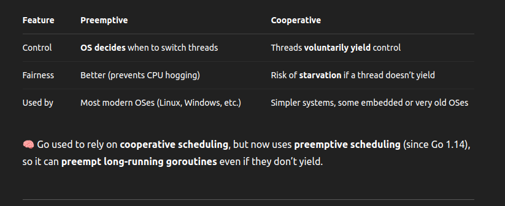

## 🔁 Preemptive vs Cooperative Scheduling

- 🧠 Go used to rely on cooperative scheduling, but now uses preemptive scheduling (since Go 1.14), so it can preempt long-running goroutines even if they don’t yield.

## ⚙️ Common CPU Scheduling Algorithms

### 🔄 1. Round-Robin (RR)

Each thread gets a fixed time slice (quantum).  

After that, it's preempted and moved to the end of the queue.  

#### ✅ Simple, fair

❌ Context switching overhead can be high  

🧠 Go’s scheduler is heavily inspired by round-robin with enhancements like work-stealing.  

### 🎖️ 2. Priority Scheduling

Each thread/process is assigned a priority level.  

Higher priority runs first.  

✅ Good for real-time systems  

❌ Risk of starvation for lower-priority tasks (can be solved with aging)  

### ⌛ 3. Shortest Job First (SJF) / Shortest Remaining Time First (SRTF)

Runs the task with the least estimated time left.  

SRTF = Preemptive version of SJF.  

✅ Optimal average turnaround  
❌ Requires knowledge of job lengths — hard to predict  

### 🔃 4. Multilevel Queue

Processes are divided into multiple queues by type (e.g., I/O-bound vs CPU-bound).  

Each queue can use a different scheduling algorithm.  

## 🧠 What Go Uses

Go's scheduler is a hybrid:  

Based on M:N scheduling (many goroutines on few OS threads).  

Inspired by Round-Robin with: 

Work stealing 

Local run queues per processor 

Preemptive scheduling (since Go 1.14+) 

