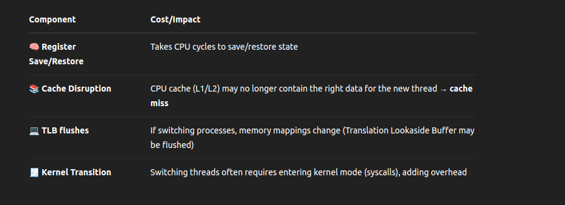

# ✅ 2. Context Switching

Context switching is the process where the CPU stops executing one thread/process and switches to another.  

Why?  

- To give other threads a chance to run (time slicing).
- When a thread blocks (e.g., waiting for I/O).
- For multitasking and responsiveness.

## 🧠 How OS Switches Between Threads/Processes

The OS scheduler handles this in steps:  

**1.Saves the current context:**  

- CPU registers (PC, stack pointer, general-purpose registers)
- Program counter (where the thread left off)
- Thread state (ready, running, waiting)

**2.Restores the next thread's context:**  

- Loads its saved registers and memory state
- Updates CPU to continue from where the thread was paused

**3.Updates the scheduler's data:**  

- Marks the old thread as ready/waiting
- Marks the new one as running

# ⚠️ Cost of Context Switching

## ⏱️ Estimated cost:

- Switching threads of the same process: ~1–2 microseconds
- Switching between processes: more costly due to memory map and cache disruption

# 🚀 Why It Matters for Go

- OS threads → high context switch cost
- Goroutines → low-cost, user-space context switching

  - Go saves only minimal state (e.g., stack pointer)
  - No syscall or OS involvement

- **That’s why Go can have millions of goroutines, while threads are expensive.**
  
