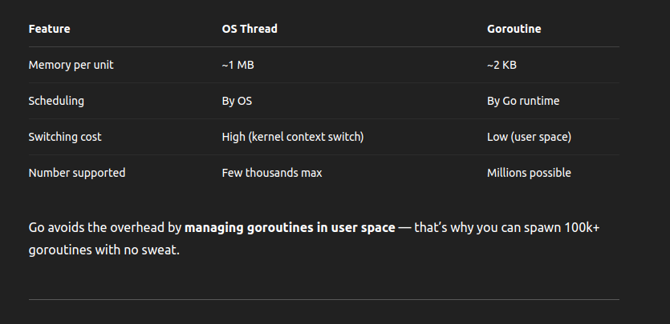
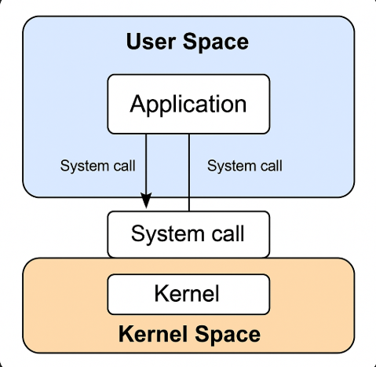

# ✅ 1. Processes vs Threads

## 🔸 What is a Process?

- An independent program in execution.
- Has its own memory space (heap, stack, code, data).
- Managed by the OS.
- Examples: Running chrome, go run main.go, python app.py.
- 📦 Think of a process as a container holding code, memory, and system resources.

## What is a Thread?

- A lightweight unit of execution within a process.
- Shares the process’s memory and resources (heap, file descriptors, etc.).
- Each process has at least one main thread — but can have more (multithreading).
- 🧵 Think of threads as workers inside the process container, doing tasks concurrently.

## 🧠 Threads Share Memory Within a Process

In a multithreaded process:  

All threads share:  

- Heap (global variables, dynamic memory)
- Open files
- Code section

Each thread has its own:  

- Stack (local variables, function calls)
- Registers (CPU context)

✅ This shared memory is powerful for communication, but dangerous if not synchronized → leads to race conditions, deadlocks, etc.  

# ⚠️ Overhead of Creating Threads

Creating an OS thread involves:  

- Allocating memory (stack)
- Asking the OS to register it
- OS has to manage context switching between threads

## 📉 Thread overhead includes:

- Stack size: Usually 512 KB to 1 MB per thread (wastes memory)
- Context switch cost: ~1–2 µs (saving/restoring CPU state)
- OS scheduling: Might involve syscall/locking

## 🔁 If you create thousands of threads, you:

- Waste memory
- Trigger high context switching
- Hit OS thread limits

## 🟢 Why Go Uses Goroutines Instead of Threads

## User Space

### 👥 What is User Space?

In modern operating systems, the memory and execution environment is split into two main parts:

- **User Space**: Where your applications (like Go, Chrome, VS Code) run
- **Kernel Space**: Where the operating system code runs (manages memory, hardware, I/O, processes)

### 🔸 User Space

- It's the sandboxed environment where your code runs.
- Apps can’t directly access hardware or kernel memory.
- If you want to do something "low-level" (like read a file or open a socket), your program makes a system call, which temporarily enters kernel space.

### 🧠 Example:

- Your Go program is in user space.
- When you do os.Open("file.txt"), it makes a syscall to the kernel to actually access the file.

### 🔹 Kernel Space

- The core of the OS lives here.
- Controls CPU, memory, disk, networking, and security.
- Only trusted code runs here (like the OS scheduler, disk drivers, etc).

## ⚙️ Why Is This Separation Important?

Reason Benefit  

- 🛡️ Security Apps can't mess with the OS or each other
- ⚡ Stability If your app crashes, it doesn't take down the OS
- 🚀 Performance Syscalls are optimized and controlled

### 💡 Bonus: In Go's Scheduler

- Goroutines are scheduled in user space, by the Go runtime.
- Threads are scheduled by the kernel (in kernel space).

👉 **This is why goroutines are faster and lighter: no need to involve the OS for every context switch.**

