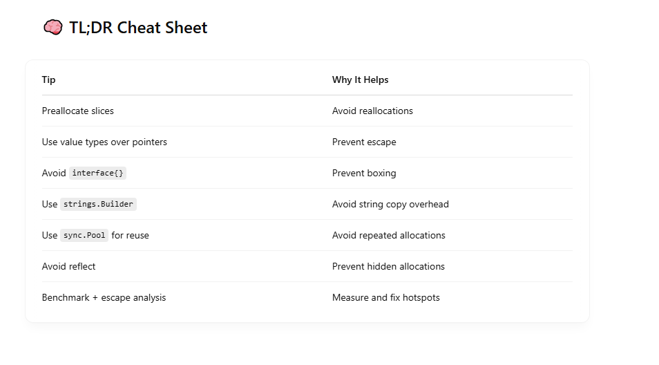

Minimizing heap allocations in Go is one of the fastest wins for performance, especially in tight loops or high-throughput services. Go’s garbage collector is efficient, but heap allocations still cost CPU, memory, and GC pause time. <br>
Here’s a tactical breakdown of how to minimize heap allocations in Go: <br>

# 🧠 Understand: What Causes Heap Allocations?

- A value escapes the current function scope (like when returning pointers)
- Interfaces box values
- You create large objects
- You use append() without capacity planning
- defer, reflect, or closures are involved

# ✅ Strategies to Minimize Heap Allocations

## 1. Use Value Types Instead of Pointers (When Safe)

```
type User struct {
    Name string
}

// ❌ Escapes: returns pointer
func NewUser(name string) *User {
    return &User{Name: name}
}

// ✅ Avoids heap if User is small and local
func NewUserStack(name string) User {
    return User{Name: name}
}

```

=> Use value receivers unless your type is large or mutable. <br>

## 2. Pre-allocate Slices with make()

```
// ❌ Frequent reallocations (and heap growth)
nums := []int{}
for i := 0; i < 1000; i++ {
    nums = append(nums, i)
}

// ✅ Pre-allocated capacity
nums := make([]int, 0, 1000)

```

## 3. Use strings.Builder for String Concatenation

```
// ❌ Each += allocates new string
s := ""
for _, part := range parts {
    s += part
}

// ✅ Efficient buffer reuse
var b strings.Builder
for _, part := range parts {
    b.WriteString(part)
}
s := b.String()

```

## 4. Use sync.Pool for Large Objects or Buffers

Great for temporary large structs, byte buffers, etc. <br>

```
var bufPool = sync.Pool{
    New: func() interface{} {
        return make([]byte, 1024)
    },
}

buf := bufPool.Get().([]byte)
defer bufPool.Put(buf)

```

=> Use carefully — don’t store pointers from pooled objects long-term. <br>

## 5. Avoid Capturing Variables in Closures (when not needed)

```
func makeAdder(x int) func(int) int {
    return func(y int) int {
        return x + y // x escapes
    }
}

```

=> Closures can force heap allocation because captured variables live beyond their scope.

## 6. Avoid Interface{} Where Possible

```
// ❌ allocates to box int into interface{}
var i interface{} = 123

// ✅ keep it as int
var x int = 123

```

=> Use generics if you need abstraction without allocations.

## 7. Use Generics Instead of Interface + Reflection

```
// ❌ With interface{} → boxing
func PrintAll(items []interface{}) { ... }

// ✅ With generics → no boxing
func PrintAll[T any](items []T) { ... }

```

## 8. Use Struct Embedding Instead of Pointers When Possible

```
type Config struct {
    Timeout int
}

// ✅ Inline
type Server struct {
    Config
}

```

## 9. Minimize Use of defer in Tight Loops

- Each defer adds a small allocation (on the stack, usually, but can promote to heap under pressure)
- If you're calling defer inside millions of iterations, consider manual cleanup.


