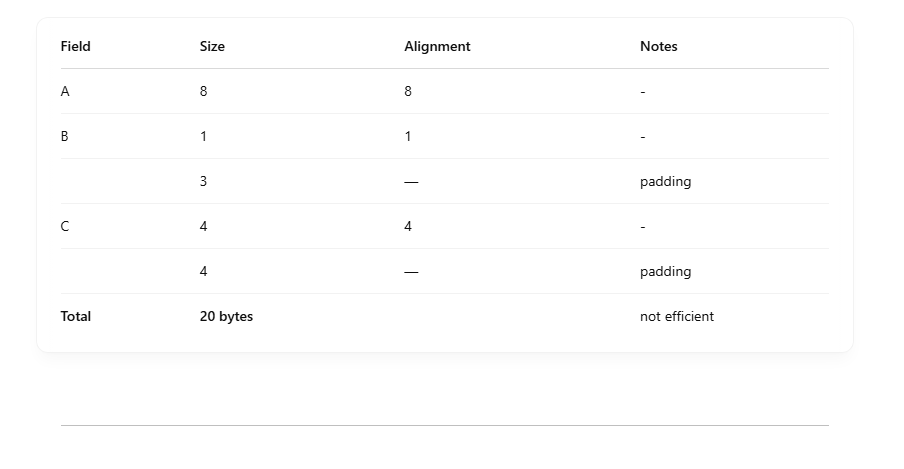
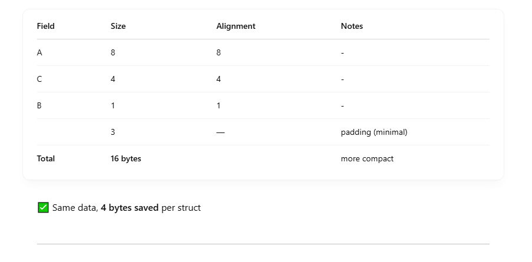
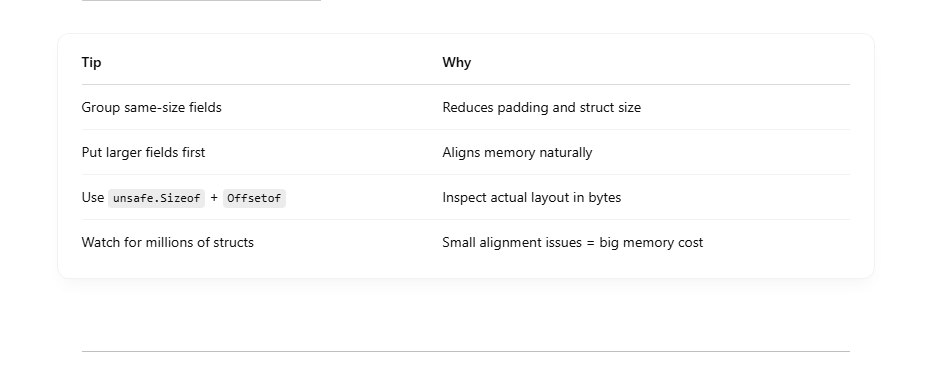

# 🧠 What is Memory Alignment?

Memory alignment means placing variables in memory at addresses that are multiples of their type's size.
For example: <br>

- int32 wants to be at an address divisible by 4
- int64 wants alignment on an 8-byte boundary
- bool and byte want 1-byte alignment

## ✅ Why alignment matters:

- CPU reads data faster when it's aligned — misalignment may require extra CPU cycles or cause crashes (on some architectures).

- Go will insert padding to enforce alignment, even if it wastes memory.

## 💣 Pitfall: Bad Field Ordering Wastes Space

- Go’s structs are automatically padded to maintain proper alignment.
- If you order fields inefficiently, Go adds padding bytes, which increases memory usage — especially when you have lots of instances (like millions in a slice).

```
type Bad struct {
    A int64  // 8 bytes
    B int8   // 1 byte
    C int32  // 4 bytes
}
```

Actual memory layout <br>



## ✅ Better Field Ordering:

```
type Good struct {
    A int64
    C int32
    B int8
}

```



## 🔁 Impact on Performance

### 🔥 When it matters:

- You allocate millions of structs (e.g. in a slice)
- Cache lines are tight (64 bytes on most CPUs)
- Misaligned fields = extra memory bandwidth + CPU cache misses

### ⚠️ Not always about speed:

- Misalignment often hurts memory usage more than raw speed
- But cache efficiency drops, which slows things down indirectly

## 🧪 Inspect Struct Layout

```
import (
    "fmt"
    "unsafe"
)

type MyStruct struct {
    A int64
    B int8
    C int32
}

func main() {
    fmt.Println("Size:", unsafe.Sizeof(MyStruct{}))
    fmt.Println("A offset:", unsafe.Offsetof(MyStruct{}.A))
    fmt.Println("B offset:", unsafe.Offsetof(MyStruct{}.B))
    fmt.Println("C offset:", unsafe.Offsetof(MyStruct{}.C))
}

```

## 🧠 TL;DR Cheat Sheet



## 🧠 Bonus: Cache Line Awareness

- Each cache line is ~64 bytes. Efficient structs can fit more per line → fewer cache misses → better performance.

- For performance-critical apps (e.g. in game engines, networking, real-time systems), struct layout + cache behavior = 🔑.
