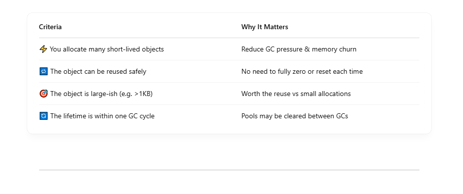
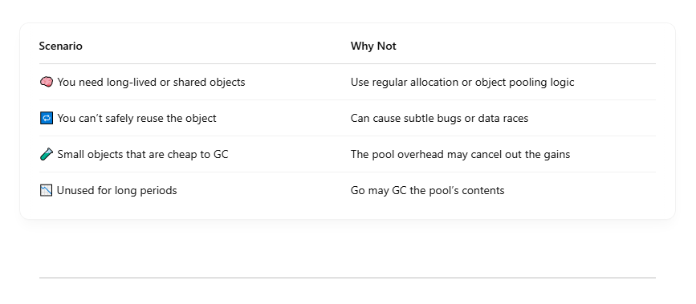
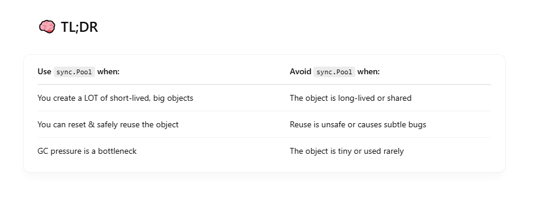

sync.Pool is a powerful tool for reducing memory allocations and GC pressure in high-throughput Go programs. But it’s not a silver bullet — it shines only in specific scenarios. <br>

## 🧠 What is sync.Pool?

- **sync.Pool** is a concurrent-safe object cache designed for temporary, short-lived objects. It lets you reuse memory instead of allocating new objects all the time.

```
var bufPool = sync.Pool{
    New: func() interface{} {
        return make([]byte, 1024)
    },
}

buf := bufPool.Get().([]byte)
defer bufPool.Put(buf)

```

## ✅ When Should You Use sync.Pool?



# 💥 Real-World Use Cases

## 1. Byte Buffers in Web Servers / APIs

```
var bufPool = sync.Pool{
    New: func() interface{} {
        return new(bytes.Buffer)
    },
}

```

- Avoids per-request allocation
- Reused per HTTP handler
- Must reset before reuse: buf.Reset()

## 2. Reusable JSON or Gob Encoders/Decoders

```
type JSONEncoder struct {
    buf *bytes.Buffer
    enc *json.Encoder
}

```

Instead of allocating encoders per request, you can pool them <br>

## 3. Temporary Structs in Parsers / Transcoders

If you're reading millions of structs from a file or network, pool the containers that hold intermediate results.

# ⚠️ When NOT to Use sync.Pool



# 🔬 Performance Tips

- Always reset pooled objects before reuse (buf.Reset(), slice[:0], etc.)
- Don’t keep references to pooled objects after Put()
- Benchmark with go test -benchmem — don’t assume pooling is faster!

## 🧪 Example Benchmark: With vs Without Pool

```
func BenchmarkNoPool(b *testing.B) {
    for i := 0; i < b.N; i++ {
        _ = make([]byte, 4096)
    }
}

var bytePool = sync.Pool{
    New: func() interface{} {
        return make([]byte, 4096)
    },
}

func BenchmarkWithPool(b *testing.B) {
    for i := 0; i < b.N; i++ {
        buf := bytePool.Get().([]byte)
        _ = buf[:0]
        bytePool.Put(buf)
    }
}

```

You’ll likely see: <br>

- ✅ Fewer allocations/op (allocs/op)
- ✅ Less memory usage (B/op)


