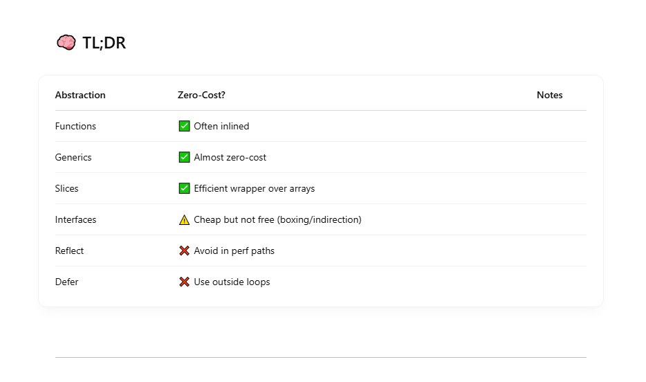

```
Zero-cost abstraction means:

“You don’t pay for what you don’t use.”
Or more precisely: “An abstraction has no overhead compared to writing the equivalent low-level code by hand.”
```

## ✅ How It Applies in Go

Go is a runtime-managed, garbage-collected language, so not everything is zero-cost. BUT — Go has several low-overhead abstractions that are close to zero-cost, especially when used well.

### 1. Functions and Inlining

```
func double(x int) int {
    return x * 2
}

```

=> ✅ Inlined automatically if small enough. No call overhead.

### 2. Interfaces (with Caveats)

```
type Reader interface {
    Read([]byte) (int, error)
}

```

- ✅ Interface calls are fast (indirect function calls).
- ❌ But using them causes value boxing, and sometimes heap allocations.
- ✅ If you use them carefully (no escape, no boxing), the overhead is minimal.

### 3. Generics (Go 1.18+)

Generics bring Go closer to zero-cost abstraction: <br>

```
func Map[T, R any](items []T, fn func(T) R) []R

```

- ✅ Monomorphized at compile time for performance
- ❌ Slight abstraction overhead due to interface{}-style constraints in some cases
- Still, this is a major step forward for Go.

### 4. Slice vs Array Wrapping

```
func process(data []byte) { ... }  // Slice = pointer + len + cap

```

- ✅ Slices are fat pointers, but cost the same as passing a pointer + size manually.
- ✅ No extra heap allocation for slicing.
- So this is a zero-cost abstraction over raw arrays + size bookkeeping.

### 5. Defer (NOT Zero-Cost)

```
defer file.Close()

```

- ❌ Adds stack frames or hidden allocations, especially in tight loops.
- So: Not zero-cost. Avoid in hot code.



