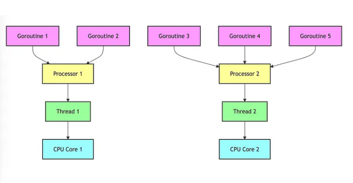

# Introduction

- **In Go, processors (often referred to as Goroutine Processors or just P) are an abstraction used to manage the execution of goroutines on operating system threads. They play a key role in Go’s runtime scheduler and are part of the GOMAXPROCS setting, which defines how many OS threads can execute Go code concurrently.**

Let’s break this down in simpler terms: <br>

## The GOMAXPROCS Environment

- Go uses a concurrency model called **M scheduling**,

where **M** goroutines are multiplexed onto **N** OS threads. In this model, **P** represents a logical processor that manages scheduling of goroutines onto threads.

- **Goroutines (G)**: These are lightweight, user-space threads in Go. When you call go func(), you are creating a new goroutine.

- **Processors (P)**: These are logical processors or CPUs that manage the scheduling of goroutines on OS threads. Think of P as a scheduler for goroutines.

Each processor (P) is responsible for: <br>

- Holding goroutines that are ready to run in its local queue.
- Distributing those goroutines to threads (M) for execution.
- Ensuring that no more goroutines than available processors (P) are running simultaneously.
- Threads **(M)**: These are OS-level threads (managed by the operating system). Goroutines run on these threads.



## Key Concepts:

1. **Goroutines (G1, G2, G3, etc.):**

- Goroutines are cheaper and more efficient than traditional OS threads. You can run thousands or even millions of goroutines without consuming too much memory or system resources.
- Goroutines are executed based on a schedule controlled by Go’s runtime scheduler, not directly by the OS.

2. **Processors (P1, P2):**

- Processors don’t execute goroutines themselves but act as middlemen, assigning the goroutines to available threads.
- Go allows you to control how many processors are used through the GOMAXPROCS setting, which defines how many processors can run goroutines simultaneously. By default, GOMAXPROCS is set to the number of CPU cores available.
- Each processor has its own queue of goroutines that it schedules onto threads for execution.

3. **Threads (M1, M2):**

- Threads (M) in Go are actual OS threads. These are the entities that the OS manages to execute tasks on CPU cores.
- When a processor (P) schedules a goroutine, it assigns it to a thread, which then executes that goroutine on a CPU core.
- Threads are part of the Go runtime’s management, meaning Go may create or destroy threads as necessary. This is abstracted away from the user.

4. **CPU Cores (CPU1, CPU2):**

- CPU Cores are the physical processors inside your machine that execute the instructions of your programs.
- In the diagram above, each thread is mapped to a CPU core, meaning the thread is running the goroutine’s tasks on that core.

```
Note :
1. There is not a strict one-to-one mapping between CPU cores and threads (M) in Go.
2. One Thread Can Run on Multiple CPU Cores (but not at the same time).
3. Multiple threads can share the same CPU core, but they don’t run simultaneously on the same core.
```

## How Go’s Scheduler Works:

- Go’s scheduler ensures that all goroutines get a chance to run. It distributes goroutines across processors (P) in a way that maximizes performance by balancing the load between threads and CPU cores.
- **Concurrency Control**: Even though the system might have fewer CPU cores than the number of goroutines, the Go runtime scheduler manages this efficiently by switching between goroutines when necessary, using mechanisms like preemption (interrupting one goroutine to allow another to run).
- **Parallelism**: If your machine has multiple CPU cores, Go can achieve parallelism — multiple goroutines can truly run at the same time on different cores.
- **Thread and Goroutine Pooling**: Go doesn’t create a thread for every goroutine. Instead, it uses a pool of threads and schedules goroutines onto them. This minimizes the overhead of creating and managing OS threads.

## Why Is This Efficient?

- **Lightweight Goroutines:** Since goroutines are much lighter than OS threads, Go can handle a large number of concurrent tasks without significant performance penalties.
- **Balanced Scheduling**: The Go scheduler dynamically balances the workload across available CPU cores, ensuring that no CPU core is over or underutilized. This leads to efficient execution of tasks.
- **Optimized Resource Usage**: Instead of having an excessive number of OS threads, Go keeps the number of threads manageable, reducing the overhead associated with thread context switching, memory usage, and CPU cycles.

## Why Are Processors Important?

- Processors (P) allow Go to control the number of goroutines that can run in parallel, preventing too many from running on OS threads at the same time, which would otherwise cause performance degradation due to excessive context switching.

- The GOMAXPROCS setting determines how many processors (P) are available. If you have 4 processors, Go will run goroutines on at most 4 OS threads simultaneously. By default, GOMAXPROCS is set to the number of CPU cores on your machine, but you can change it using runtime.GOMAXPROCS().

## Example

Imagine you have a machine with 4 CPU cores, and the default GOMAXPROCS is 4. This means: <br>

- You have 4 processors (P), each one can hold a queue of goroutines.
- The Go runtime will use up to 4 threads (M) to execute the goroutines.
- If there are more than 4 goroutines, they will be managed by the Ps and will be scheduled in a fair manner to use available threads.
