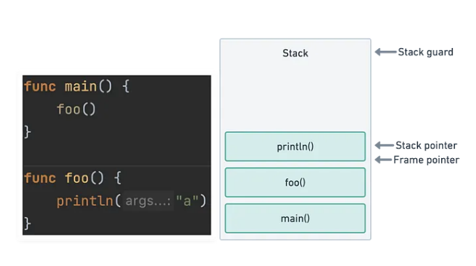
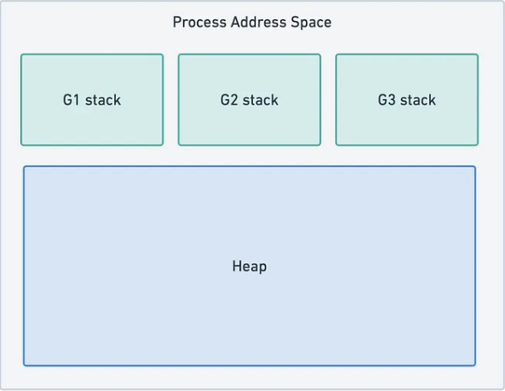
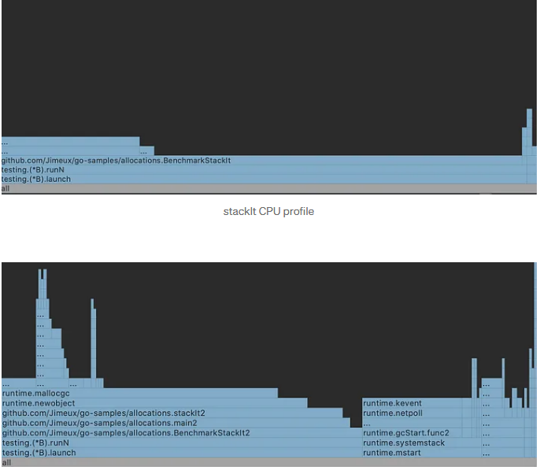

# The stack and heap we know and love

To discuss the allocs/op stat in Go, we’re going to be interested in two areas of memory in our Go programs: the stack and the heap. <br>

In many popular programming environments the stack usually refers to the call stack of a thread. A call stack is a LIFO stack data structure that stores arguments, local variables, and other data tracked as a thread executes functions. Each function call adds (pushes) a new frame to the stack, and each returning function removes (pops) from the stack. <br>

We must be able to safely free the memory of the most recent stack frame when it’s popped. We therefore can’t store anything on the stack that later needs to be referenced elsewhere. <br>



Since threads are managed by the OS, the amount of memory available to a thread stack is typically fixed, e.g. a default of 8MB in many Linux environments. This means we also need to be mindful of how much data ends up on the stack, particularly in the case of deeply-nested recursive functions. If the stack pointer in the diagram above passes the stack guard, the program will crash with a stack overflow error. <br>

The heap is a more complex area of memory that has no relation to the data structure of the same name. We can use the heap on demand to store data needed in our program. Memory allocated here can’t simply be freed when a function returns, and needs to be carefully managed to avoid leaks and fragmentation. The heap will generally grow many times larger than any thread stack, and the bulk of any optimization efforts will be spent investigating heap use. <br>

## The Go stack and heap

Threads managed by the OS are completely abstracted away from us by the Go runtime, and we instead work with a new abstraction: goroutines. Goroutines are conceptually very similar to threads, but they exist within user space. This means the runtime, and not the OS, sets the rules of how stacks behave. <br>


Rather than having hard limits set by the OS, goroutine stacks start with a small amount of memory (currently 2KB). Before each function call is executed, a check within the function prologue is executed to verify that a stack overflow won’t occur. In the below diagram, the convert() function can be executed within the limits of the current stack size (without SP overshooting stackguard0). <br>

**If this wasn’t the case, the runtime would copy the current stack to a new larger space of contiguous memory before executing convert(). This means that stacks in Go are dynamically sized, and can typically keep growing as long as there’s enough memory available to feed them.** <br>

The Go heap is again conceptually similar to the threaded model described above. All goroutines share a common heap and anything that can’t be stored on the stack will end up there. When a heap allocation occurs in a function being benchmarked, we’ll see the allocs/ops stat go up by one. It’s the job of the garbage collector to later free heap variables that are no longer referenced. <br>

# How do we know when a variable is allocated to the heap?

```
Go compilers will allocate variables that are local to a function in that function’s stack frame. However, if the compiler cannot prove that the variable is not referenced after the function returns, then the compiler must allocate the variable on the garbage-collected heap to avoid dangling pointer errors. Also, if a local variable is very large, it might make more sense to store it on the heap rather than the stack.

If a variable has its address taken, that variable is a candidate for allocation on the heap. However, a basic escape analysis recognizes some cases when such variables will not live past the return from the function and can reside on the stack.
```

Since compiler implementations change over time, there’s no way of knowing which variables will be allocated to the heap simply by reading Go code. It is, however, possible to view the results of the escape analysis mentioned above in output from the compiler. This can be achieved with the gcflags argument passed to go build. A full list of options can be viewed via go tool compile -help. <br>

For escape analysis results, the -m option (print optimization decisions) can be used. Let’s test this with a simple program that creates two stack frames for functions main1 and stackIt. <br>

```
func main1() {
   _ = stackIt()
}
//go:noinline
func stackIt() int {
   y := 2
   return y * 2
}
```

Since we can can’t discuss stack behaviour if the compiler removes our function calls, the noinline pragma is used to prevent inlining when compiling the code. Let’s take a look at what the compiler has to say about its optimization decisions. The -l option is used to omit inlining decisions <br>

```
$ go build -gcflags '-m -l'
# github.com/Jimeux/go-samples/allocations
```

Here we see that no decisions were made regarding escape analysis. In other words, variable y remained on the stack, and didn’t trigger any heap allocations. We can verify this with a benchmark. <br>

```
$ go test -bench . -benchmem
BenchmarkStackIt-8  680439016  1.52 ns/op  0 B/op  0 allocs/op
```

s expected, the allocs/op stat is 0. An important observation we can make from this result is that copying variables can allow us to keep them on the stack and avoid allocation to the heap. Let’s verify this by modifying the program to avoid copying with use of a pointer. <br>

```
func main2() {
   _ = stackIt2()
}
//go:noinline
func stackIt2() *int {
   y := 2
   res := y * 2
   return &res
}
```

Let’s see the compiler output. <br>

```
go build -gcflags '-m -l'
# github.com/Jimeux/go-samples/allocations
./main.go:10:2: moved to heap: res
```

The compiler tells us it moved the pointer res to the heap, which triggers a heap allocation as verified in the benchmark below <br>

```
$ go test -bench . -benchmem
BenchmarkStackIt2-8  70922517  16.0 ns/op  8 B/op  1 allocs/op
```

So does this mean pointers are guaranteed to create allocations? Let’s modify the program again to this time pass a pointer down the stack. <br>

```
func main3() {
   y := 2
   _ = stackIt3(&y) // pass y down the stack as a pointer
}

//go:noinline
func stackIt3(y *int) int {
   res := *y * 2
   return res
}
```

Yet running the benchmark shows nothing was allocated to the heap. <br>

```
$ go test -bench . -benchmem
BenchmarkStackIt3-8  705347884  1.62 ns/op  0 B/op  0 allocs/op
```

The compiler output tells us this explicitly. <br>

```
$ go build -gcflags '-m -l'
# github.com/Jimeux/go-samples/allocations
./main.go:10:14: y does not escape
```

Why do we get this seeming inconsistency? stackIt2 passes res up the stack to main, where y will be referenced after the stack frame of stackIt2 has already been freed. The compiler is therefore able to judge that y must be moved to the heap to remain alive. If it didn’t do this, y wouldn’t exist by the time it was referenced inmain. <br>

stackIt3, on the other hand, passes y down the stack, and y isn’t referenced anywhere outside main3. The compiler is therefore able to judge that y can exist within the stack alone, and doesn’t need to be allocated to the heap. We won’t be able to produce a nil pointer in any circumstances by referencing y. <br>

A general rule we can infer from this is that sharing pointers up the stack results in allocations, whereas sharing points down the stack doesn’t. However, this is not guaranteed, so you’ll still need to verify with gcflags or benchmarks to be sure. What we can say for sure is that any attempt to reduce allocs/op will involve hunting out wayward pointers. <br>

## Why do we care about heap allocations?

We’ve learnt a little about what the alloc in allocs/op means, and how to verify if an allocation to the heap is triggered, but why should we care if this stat is non-zero in the first place? The benchmarks we’ve already done can begin to answer this question. <br>

```
BenchmarkStackIt-8   680439016  1.52 ns/op  0 B/op  0 allocs/op
BenchmarkStackIt2-8  70922517   16.0 ns/op  8 B/op  1 allocs/op
BenchmarkStackIt3-8  705347884  1.62 ns/op  0 B/op  0 allocs/op
```

Despite the memory requirements of the variables involved being almost equal, the relative CPU overhead of BenchmarkStackIt2 is pronounced. We can get a little more insight by generating flame graphs of the CPU profiles of the stackIt and stackIt2 implementations.

<br>



stackIt has an unremarkable profile that runs predictably down the call stack to the stackIt function itself. stackIt2, on the other hand, is making heavy use of a large number of runtime functions that eat many additional CPU cycles. This demonstrates the complexity involved in allocating to the heap, and gives some initial insight into where those extra 10 or so nanoseconds per op are going <br>
